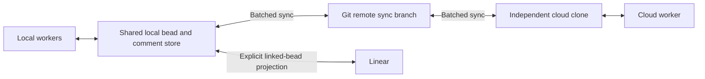

# Feature: Incremental Bead Coordination and Native Comments

**Date:** 2026-09-06

**Author:** Joshua Levy (github.com/jlevy) with LLM assistance

**Status:** Active. Phase 1 is in progress.
The embedded provider-comment recovery slice (`tbd-hqb9`, PR #279) and the dormant
native-comment record/storage foundation (`tbd-e1tu`, PR #282) are implemented.
The stacked inventory and immutable-transition foundation (`tbd-4r3w`, PR #283) is also
implemented and dormant.
PRs #282 and #283 do not change the current f08 format or expose public behavior.
The Phase 1 owner (`tbd-3eui`) and Phase 2 owner (`tbd-raxf`) remain open.
Within the Phase 2 stack, only `tbd-e1tu` and `tbd-4r3w` are complete; the Git guards,
recovery, compatibility, format, command, polling, and provider-projection gates remain
open.

**Tracking:** `tbd-khi1`; completed historical plan preparation `tbd-q90q`.

**Research:**
[Bead Watching, Comments, and Cross-Agent Coordination](../../research/current/research-2026-09-06-bead-agent-coordination.md).
The research owns source evidence, reproduced defects, alternatives, and prior-plan
reconciliation. This spec owns the incremental implementation and release gates.

## Overview

An agent should be able to claim a bead, discuss it with other agents, delegate work,
and continue when its dependencies finish.
Humans should participate through comments on the subset of beads linked to Linear.
Small agent-only tasks must work without an external issue, pull request, or Linear
account.

Use the existing Git sync branch as the shared transport across independent cloud
environments. Local filesystem observation accelerates agents sharing a bead store.
Native comments become the durable conversation records; Linear is an optional
projection. A foreground coordinator batches publication and observation, while thin
runtime adapters give agents an opportunity to process relevant changes.

Ship five independently useful increments.
The first repairs existing behavior without waiting for a native-comment format or
runtime integration.
Later increments remain optional until their correctness, recovery, and operational
gates pass.

| Phase | Usable result | Owner | Prerequisite |
| --- | --- | --- | --- |
| 1. Stabilize | Existing comments survive recovery; delivery retries and cooperative claims have explicit contracts | `tbd-3eui` | Existing source and reproduction baseline |
| 2. Native comments | Any bead supports durable append-only discussion, bounded reads, and complete manual Git exchange | `tbd-raxf` | Phase 1 |
| 3. Continuous Git coordination | Nearby and cloud workers discover records without each agent running its own full sync loop | `tbd-oymd` | Phase 2 |
| 4. Human conversation | Native comments and Linear comments converge on explicitly linked beads | `tbd-osng` | Phase 2; can proceed independently of Phase 3 |
| 5. Runtime workers | Opt-in Claude/Codex workers catch up, claim eligible work, act, and recover | `tbd-70df` | Phase 3 |

A phase can contain several small PRs.
Closing a phase requires its complete release gate; merging a component is not evidence
that the phase is usable end to end.
An f08 release may contain unreachable internal model or inventory code and pure tests
for future invariants when release checks prove that code has no runtime, public API,
configuration, format, or generated-scaffold path.
Do not advertise such a component as native-comment support.
Phase 2 preservation wiring, usable native-comment behavior, f09 activation, native CLI
surfaces, and provider conversion remain behind their own gates.
The mixed human/agent adoption gate (`tbd-gtwx`) follows both Phases 4 and 5; it does
not block the native-only Phase 5 release.

## Goals

- Preserve acknowledged comments across concurrent additions, retries, process crashes,
  Git merges, workspace/outbox operations, and history recovery.
- Support both shared local stores and independent cloud clones using Git as the only
  required shared transport.
- Give each worker bounded, targeted context and recoverable progress instead of
  repeatedly injecting the full task graph or discussion history.
- Keep human accountability, agent delegation, message delivery, and task completion
  distinct.
- Support configurable Linear comment direction with `two_way` as the default for
  enabled projection on explicitly linked beads.
- Make each release useful with explicit activation, observable limits, and a tested way
  to stop automation without discarding records.

## Non-Goals

- Exclusive distributed claims from ordinary Git merges, lease expiry that fences file
  writes, or an automatic cross-host leader election protocol.
- A mandatory relay, database service, hosted scheduler, or runtime vendor.
  Agent Mail informs delivery and recovery contracts; adopting its service is a separate
  decision.
- A general event-sourcing or relationship-CRDT rewrite, transactional multi-bead
  editing, full session dashboards, or replacement of the existing tracker plans.
- Private messages, arbitrary attachments, reactions, comment edits/deletions, or
  automatic child-thread forwarding to an epic in the initial comment model.
- Streaming every tool event or token through Git, subsecond cross-cloud delivery
  guarantees, or an unmeasured throughput-parity claim against Agent Mail.

## Background

The reviewed tbd v0.8.1 baseline already has immutable bead IDs, dependencies,
assignee/delegate fields, locked local claims, isolated remote watching, and Linear
comment exchange. The dated baseline reproduced embedded provider-comment loss in
recovery, duplicate external posts across replicas, identity-alias conflicts, and
shared-checkout identity ambiguity.
PR #279 repairs the first defect while leaving the other Phase 1 work open.
The current watcher observes committed endpoint differences, not a durable message
queue. It does not drain an initial backlog, and elapsed deferral dates do not produce
Git changes by themselves.

Several useful performance mechanisms already exist.
Watch polls the remote tip with `ls-remote` and fetches only when it changes; its
default interval is 30 seconds and its minimum is 10 seconds.
The web observer combines native filesystem events with reconciliation.
`tbd sync --issues` excludes docs and external integrations.
Sync-branch commits and pushes already bypass source-code hooks; this repository’s
push-triggered CI targets `main`. That branch filter is repository-specific.
An unfiltered `on: push` workflow can launch expensive CI for every `tbd-sync`
publication, and server-side branch rules can reject the direct pushes that low-overhead
coordination requires.
Phase 3 must inspect both conditions before enabling a continuous cadence.
See [workflow branch filters][github-actions-branch-filters] and
[GitHub rulesets][github-rulesets].

**GitHub constraints, checked 2026-09-06:** GitHub recommends at most six pushes per
minute and fifteen Git read operations per second per repository.
It also recommends keeping `.git` below 10 GB and individual directories below 3,000
entries. These are repository-health guidelines, not guaranteed quotas or a documented
seventh-push failure.
Branches do not receive independent repository budgets; exact `ls-remote` accounting is
not specified. See [GitHub repository limits][github-limits].

The ordinary authenticated REST API allowance is generally 5,000 requests/hour, with
additional secondary limits.
That is not a Git-protocol polling allowance.
This design uses Git operations for its core transport and budgets them separately; any
optional API adapter must honor its own response headers and limits.
[REST API limits][github-api-limits]

## Design

### Approach

Keep task truth, conversations, transport progress, and runtime activity separate:

Each common directory may have one transport coordinator and many local subscribers.
Independent clones still publish their own writes.
A coordinator cannot collect another clone’s unpublished comments through Git without
that clone first pushing.
The runtime worker and Linear bridge can be stopped independently of native storage.

### Native comment records

Use one independently published document per comment, linked to an immutable internal
bead ID. The record’s authoritative relation points from comment to bead; do not update
an inverse comment-ID array in the bead on every append.

| Field | Contract |
| --- | --- |
| Comment ID | Stable opaque identity; retries reuse it; imported provider identities converge across clones |
| Bead ID | Immutable internal issue ID, independent of display-prefix mappings |
| Author | Portable actor identity and display snapshot; allowlisted provenance metadata; separate from transport credentials |
| Creation time | Display/audit metadata, never the sole delivery cursor |
| Reply reference | Optional immutable comment ID; missing parents remain visible and recoverable |
| Body | Complete native Markdown content, immutable after publication in the initial model |

Physical storage belongs under the sync data root in a sharded `comments/` tree.
Choose and test the ID grammar and shard layout before freezing the format.
Hash-based fanout must avoid concentrating chronologically adjacent IDs in one
directory. No provider namespace or external issue is required to create a native
comment.

Publication must not replace an existing ID with different content.
An identical retry returns the existing result; a mismatched retry or conflicting
imported record is reported and preserved for repair.
This invariant applies to normal writes, clean Git merges, conflict resolution,
save/import, and rescue.
Atomic rename with replacement is not sufficient.
A successful write means the complete record is locally published under the documented
filesystem durability contract; it is not a promise of remote delivery or arbitrary
power-loss durability.

Deletion or reparenting of an observed immutable record is also an incompatible
mutation. Preserve or quarantine it for repair, including fast-forward deletions and
delete/modify merges; do not inherit an existing bridge’s absence-wins rule.
Stored author metadata records attribution, not cryptographic proof of authorship.

Keep provider aliases, destination lineage, and delivery intents in separate bridge
records. Define deterministic provider-origin identity and outbound echo reconciliation
before enabling projection.
A local comment plus its provider alias must converge to one logical record even if
replicas learn those identities in different orders.
Preserve original authorship; do not label all comments as the bridge’s credential
owner.

Native comments retain full text.
The existing provider projection’s 50-body retention and old text stubs cannot become
the native history policy.
Reads have explicit record and byte limits.
Oversized writes or provider projections return explicit errors and preserve the native
record; there is no silent truncation of durable prose.

### Format, migration, and recovery

Reserve f09 as the candidate format boundary for native comment records, subject to the
`tbd-z3ag` format-freeze gate.
Existing readers enumerate only known entity paths in several sync and recovery
operations; issue-level f08 passthrough does not make them safe native-comment clients.

Activation has two separately releasable steps:

1. Ship an f08-compatible preservation release with no native writer and no format
   activation. It must inventory and preserve the future comment and conflict-evidence
   trees through broad staging, commits, fast-forwards, merges, push retries,
   workspace/outbox movement, doctor repair, and unrelated-history rescue.
2. Establish that preservation release as the minimum binary for every participating
   writer, then ship a separately reviewed f09 activation.
   Only an explicitly enabled f09 client may create native records.

The preservation release must remain safe from an independent clone whose source branch
and working-tree config have not incorporated the f09 activation commit.
A local `tbd_format` check protects a client only after it sees that config.
Ordinary Git cannot fence a pre-preservation clone that never incorporates the
activation commit, so an unknown or older writer blocks activation.
A deployment that requires hard refusal across uncontrolled writers needs a
format/capability marker on an authority every writer must read before mutation, with
enforcement that rejects writers that do not acknowledge it.
Working-tree config alone cannot provide that guarantee.

Before the first native write, schema validation, serialization, merge, doctor,
workspace save/import, automatic outbox, and unrelated-history rescue must understand
the record.
Include comments-aware one-shot queries and versioned change reports in Phase
2; continuous observation can follow in Phase 3. Preserve the existing watch contract
for consumers that have not requested the new report shape.

Comment creation and bead completion are separate writes.
Consumers tolerate a crash between them by re-reading task state and replaying stable
operations.
This plan does not introduce an implicit transaction spanning comment, issue,
and provider state.

Recovery must preserve independently added comments and identify incompatible records.
Direct import clears its source only after successful preservation; automatic sync
retains its outbox until imported data is pushed or already synchronized.
Lossy or ambiguous preservation must leave recoverable source data, even when some other
records were imported successfully.

The existing embedded provider comments now union during issue, workspace, and outbox
recovery only when both namespaces name the same nonempty provider issue ID or both
legacy namespaces omit the ID. A different ID, or a known ID paired with a missing or
malformed ID, keeps the selected namespace unchanged and archives the complete losing
namespace before a source can be cleared.
This is an f08-compatible repair to existing integration state; it does not activate
native comment records, f09, a native comment CLI, or a public API.

### Discovery, checkpoints, and ownership

Treat wake notifications as hints to query durable state.
Persist a worker’s own checkpoint only after handling or durably accepting the relevant
work. Acknowledging receipt is distinct from completing that work.
Use bounded pages and opaque cursors; never resume solely after the greatest timestamp
or ULID seen.

A local discovery index may assign a receiver-local sequence to newly observed comment
IDs, with a generation that makes reset/rebuild explicit.
This index is rebuildable and does not become a shared authority.
A missing index or checkpoint requires explicit catch-up/replay, not silently skipping
to the current tail.
Imported old-clock comments, history rewrites, index rebuilds, and consumer scope
changes have specified recovery results.
Plain issue snapshots still cannot reproduce a field changed and reverted between
observations; native append-only comment IDs remain discoverable.

Bind progress to consumer scope, index generation, and the relevant record/assignment
identities. Advance only through a contiguous handled or durably accepted prefix, or
atomically persist outstanding IDs with the checkpoint.
Completing a later item cannot skip an earlier unhandled item.
Replayed work reconciles stable action identities before producing an external effect.

Process startup drains existing eligible work and unread discussion.
Periodic readiness checks also run while Git is unchanged, so elapsed deferrals and
missed events do not strand tasks.
Capture the readiness evaluation clock in diagnostic evidence.
Waiting must never hold the shared writer lock.

Use distinct worker/session identities in a shared checkout.
Ordinary `start` retains its explicit human-directed behavior; automation gets a
conditional claim that checks status, blockers, hold, deferral, and eligible delegation
under the same shared lock as the write.
A worker proceeds only on an explicit successful claim.
A predelegated task may be eligible for its intended worker even though today’s
unassigned `ready` queue excludes delegated tasks; define that distinction rather than
weakening the queue.

Supported ownership scopes are cooperative shared-store claims and explicitly assigned
work from a designated dispatcher across clones.
The latter needs distinct assignments and explicit handoff; it has no automatic
dispatcher failover or expired-owner fencing.
Contested independent-clone self-claims remain unsupported.
Display names, session links, and successful eventual merge do not establish exclusive
authority. File overlap remains a separate worktree/review concern.

### Publication and polling policy

The continuous transport is an opt-in foreground process.
Its lifetime is managed by the calling environment; merely installing tbd or opening the
bead viewer does not start network traffic or launch agents.
One common-dir process combines local dirty notifications and subscription demand.
Keep existing read-only watch isolation and require an explicit coordinator/sync action
to apply fetched state.

Candidate defaults for the pilot are operational parameters to validate, not release
time estimates or latency promises:

| Parameter | Initial proposal |
| --- | --- |
| Active remote poll | 10 seconds, retaining the current minimum |
| Idle remote poll | Back off toward 60 seconds; shorten when local work or observed remote activity warrants it |
| Local notification | Reuse the existing debounce/reconciliation approach; benchmark larger comment stores |
| Coordination push allocation | Four attempts/minute across the declared participating writers, leaving nominal headroom for other repository activity |
| Expected independent publishers | Explicit positive count for the GitHub profile; undercounting is visible as a configuration risk |
| Sync-ref server policy | Normal direct, non-force pushes must be permitted without a PR or per-commit status-check loop |
| Push-triggered CI | Exclude `tbd-sync` from expensive workflows, or measure every triggered run inside the supported capacity envelope |
| Linear exchange | Independently configurable and bounded; not run on every fast Git tick |

Before the first continuous push, the GitHub profile must inspect the configured sync
ref’s branch protection/rulesets and inventory workflow branch filters.
If API access cannot reveal a server rule, setup must report that uncertainty and
require a controlled operator check.
A broad push workflow is unsafe at the proposed cadence until either its expensive jobs
exclude `tbd-sync` or a measured profile includes triggered runs, Actions minutes, and
their checkout/fetch traffic.
An unsupported ref policy or unmeasured CI amplification keeps continuous mode disabled
and reports an actionable reason; it must not probe the remote with repeated failed
pushes.

For `N` continuously active publishers with a coordination allocation of `P` pushes per
minute, a conservative equal-share interval is `60N/P` seconds per publisher.
With `P = 4`, one, two, and four publishers have intervals of 15, 30, and 60 seconds.
One push may contain many records and commits.
Local publication is independent of that network schedule; no empty commits or pushes
are needed during quiet periods.

The configured allocation is not a distributed token bucket.
Separate clones cannot enforce a strict aggregate rate or account for every source-code
push, and independent startup bursts may align.
Use local pacing, randomized initial delays, jitter, and conservative declared
participation; measure actual aggregate attempts and leave margin.
Retries consume the allocation.
Urgent handoffs request the next available slot rather than bypassing the budget.
Do not solve contention by force-pushing or adding per-agent remote branches as a
rate-limit workaround.

Multiplex local subscriptions into one `ls-remote` poll and fetch only changed tips.
Measure tip checks, fetches, reconciliation fetches, successful pushes, failed attempts,
bytes, lock wait, time spent waiting for publication, triggered workflow runs and
Actions minutes, and CI checkout/fetch traffic attributable to the sync ref.
Count source/CI activity as shared repository load when setting the operational
envelope. Polling uses no REST API as an assumed unlimited substitute.

Add bounded exponential backoff and jitter for contention and transient transport
failures, with explicit treatment of throttling and permanent authentication/ref-policy
errors. Preserve queued records when the coordinator stops or fails.
Any optional HTTP adapter honors provider retry instructions; Git errors do not
necessarily expose REST rate-limit headers.
Reuse safely fetched state where possible without turning a read-only watcher into an
implicit writer.

Do not commit poll timestamps, per-read receipts, or routine heartbeats to the shared
branch. Keep consumer progress local unless an explicit handoff needs a portable record.
Track source publication, remote acceptance, local receipt, and handled-work state
separately. A cloud environment that cannot push the configured sync ref must report a
blocked transport and preserve its outbox; it cannot claim to support Git-only live
coordination there.

### Linear and human participation

Reuse `integrations.linear.policy.field_sync.comments` with `two_way`, `inbound`,
`outbound`, and `off`. `two_way` remains the default once native projection is activated
for a linked pair. Current configuration is per repository/provider target; introduce
per-destination project overrides only if multiple destinations are actually supported.
The target selection’s epic/active-spec rules remain distinct from comment direction.

Native comments never implicitly create an external issue.
Only an explicitly linked bead projects to its provider issue.
A linked epic does not forward every child conversation; agents post deliberate
questions and summaries on the epic.
Initial native comments are shared discussion, not a private addressed mailbox.

Phase 2 keeps existing integration comments operational in their existing store and
clearly labels native comments as not yet projected.
Phase 4 performs an explicit, idempotent cutover to one native authority.
The old integration-comment command becomes a compatibility entry point to that
authority; it must not create a second conversation or dual-write loop.

Migration inventories complete bodies, pending outbound comments, provider aliases,
stubs, and outstanding journals.
Preserve the stable keys of already issued intents.
An inbound-only record resolves by provider/workspace/comment identity; an outbound echo
enriches its original native record.
Do not generate a new external comment merely because migration changed the local
representation. Keep bodyless legacy stubs in bridge metadata until complete text is
available, then publish the canonical native record once.
Do not publish an immutable empty placeholder and later replace its body, or deliver an
unresolved stub to a provider.

Historical native-to-Linear backfill requires an explicit preview and selection.
Existing pending integration comments retain their delivery obligations.
Decide activation and disable/re-enable eligibility using recorded identities/frontiers,
not only wall-clock timestamps.
Relinking starts a new destination lineage; old history and old intents must not
silently target the new issue.
Pausing projection preserves native discussion and aliases.
Exact cutover/queue rules are a Phase 4 gate before enabling it on real data.

Comment exchange must be independent of malformed description markers where link,
credentials, and comment policy remain valid (`tbd-bexc`). Existing linked-item safety,
orphan/archive posture, pull-only semantics, and per-item error isolation remain in
force. Make unsupported edits/deletions explicit: the initial model captures additions
and replies, and cannot present edited provider prose as synchronized native revisions.

### Runtime workers

The portable worker loop catches up, builds bounded relevant context, conditionally
claims eligible work, executes through an adapter, and records durable results before
advancing progress. It watches owned/delegated beads, selected discussion threads, and
dependencies; notifications for unrelated work do not trigger a full model invocation.
Coalesce bursts while preserving every underlying comment ID.

Adapters report whether they can wait, inject context into a running session, resume a
stopped session, or only launch a fresh run.
Preserve existing permission and approval handling.
A missing capability is an explicit operating limit, not an implicit shell workaround.
Comments and incoming Linear text are untrusted task content; reading them does not
authorize commands, broaden permissions, or start arbitrary jobs.

Separate logical worker, native session, and invocation identity.
Resume/compaction may replay lifecycle hooks; registration and handling must be
idempotent. Local checkpoints support process restart in the same store.
Moving to a new clone requires a documented checkpoint transfer or
replay-and-reconciliation path; gitignored state is not cloud portability.
Published acceptance/handoff records, when required, are batched work facts and not
per-read acknowledgments.

Persist a dispatch intent before launching a runtime and record its returned session
handle. A lost response or crash before that handle is saved creates an uncertain
outcome: reconcile against the runtime before retrying.
Stable action keys alone do not make a launch idempotent.
If the adapter cannot identify whether the original launch succeeded, pause that
dispatch for explicit recovery rather than launching a duplicate.

Use the existing session-ref plan for links and observed status, including its nested
schema/merge gate `tbd-i0de`. Runtime launch, observation, and task completion remain
separate.
Full hosted-runtime dashboards and every provider adapter are not prerequisites
for the initial Claude/Codex worker proof.

### Components

Preserve the current dependency direction: CLI orchestration depends on provider-neutral
library/file code and integration adapters.
Reuse the existing mutation lock and sync algorithms rather than creating a second
writer for the sync branch.

| Component | Existing source seams | Current state or planned addition |
| --- | --- | --- |
| Records and validation | `src/lib/{ids,native-comment,paths}.ts`, `src/file/{parser,comment-parser,comment-storage}.ts` | PR #282 implements the dormant record and create-only storage foundation; public commands and activation remain proposed |
| Inventory and transition planning | `src/file/{bounded-file,data-sync-inventory,git-object-reader,native-comment-transition,native-comment-quarantine}.ts` | PR #283 extracts shared bounded-file primitives and implements dormant bounded inventory, pure immutable-transition decisions, and individual quarantine artifacts; active Git/recovery callers remain proposed |
| Merge and recovery | `src/file/git.ts`, `src/file/workspace.ts`, `src/lib/comment-union.ts` | Shared preservation/alias rules across ordinary merge and recovery |
| Claims | `src/cli/commands/start.ts`, `src/lib/agent-identity.ts`, `src/cli/lib/data-context.ts` | Session distinction and conditional eligible-work claim |
| Observation | `src/file/bead-watch.ts`, `src/file/sync-branch-changes.ts`, `src/cli/web/local-observer.ts` | Comments-aware one-shot reports, local subscriptions, shared remote polling, cursor recovery |
| Transport | `src/cli/commands/sync.ts`, `src/file/git.ts` | Foreground scheduling, batching, pacing, retry/backoff, status |
| Provider bridge | `src/integrations/core/{comment-store,intents,sync-engine}.ts`, Linear adapter | Native source plus provider aliases, cutover, destination-stable delivery |
| Workers and instructions | `watch-beads`, `implement-beads`, prime/closing, session-ref plan | Portable loop, capability adapters, targeted context, acceptance/handoff state |

Paths in this table are relative to `packages/tbd/`. New module boundaries should follow
the existing library/file/CLI separation; no new third-party dependency is required by
this design.

### API Changes

These are proposed surfaces, not commands available in the reviewed release.
Final spelling and report versioning are settled in the owning phase before
implementation.

| Surface | Intended contract | Phase |
| --- | --- | --- |
| `tbd comment enable` | Proposed reviewed activation from f08 to the format selected by `tbd-z3ag`; unavailable until the preservation and writer-inventory gates pass | 2 |
| `tbd comment add/list/show` | Any bead; stable retry identity; full native storage; bounded text/JSON reads; reply references | 2 |
| Comments-aware one-shot changes | Newly discoverable native records, explicit report version, late-arrival and reset behavior | 2 |
| `tbd watch --local` | Read-only local wait; comments and task changes; explicit initial catch-up policy | 3 |
| `tbd sync --continuous --issues` | Opt-in foreground Git transport; no implicit Linear exchange or agent launch | 3 |
| Coordination status | Queue, last successful exchange, backoff, cursor health, publisher assumptions, capabilities | 3 |
| Existing integration comment CLI | Compatibility route to native source after cutover; provider direction still enforced | 4 |
| Conditional `start` | Atomic current-eligibility check and explicit claim outcome for cooperative shared-store automation | 1 |
| Worker run | Targeted execution, durable acceptance, dispatch recovery, adapter capabilities | 5 |

Preserve current exit-code and JSON contracts unless introducing a named version or
opt-in surface. A skipped claim is never interpreted as permission to execute merely
because the process returned zero.

## Implementation Plan

### Phase 1: Stabilize existing coordination

**Owner:** `tbd-3eui`. **Ship:** repairs to the existing release’s contracts; manual
sync and current integration comments remain usable.

- [x] Preserve independent pending embedded provider comments in save/import, automatic
  outbox, and ordinary merge when provider-link lineage matches; quarantine an
  incompatible complete namespace before source clearing (`tbd-hqb9`, PR #279).
- [ ] Reuse one destination-scoped delivery identity across replicas and retries,
  including uncertain provider responses (`tbd-6vg5`).
- [ ] Canonicalize identity aliases and preserve/report same-ID divergent content
  (`tbd-58nm`).
- [ ] Distinguish simultaneous checkout workers when accepting an existing claim
  (`tbd-6nmq`); preserve human assignee and explicit claim outcomes.
- [ ] Add the opt-in atomic eligible-work claim (`tbd-mzsw`) under the shared mutation
  lock. Preserve ordinary `start`; a prior `ready` result is not authorization after
  intervening state changes.
- [ ] Correct claim instructions (`tbd-c4zl`) and the worker recipe’s initial backlog,
  periodic readiness, and successful-claim handling (`tbd-zxg6`).
- [ ] Specify concurrent dependency removal and validate merged parent/dependency graphs
  before automated scheduling; preserve conflicts and report invalid affected work
  instead of silently selecting an arbitrary graph (`tbd-7ybg`).

**Acceptance:** The research’s actual loss/duplicate/alias reproductions fail before
their repair and pass afterward.
Add real filesystem/CLI recovery cases, including the automatic outbox path not executed
by the original probe.
Contested local claims allow one eligible worker to proceed; independent-clone tests
demonstrate and label the unsupported exclusivity case.
Test changes to blockers, hold, deferral, and delegation between discovery and
conditional claim.
Existing manual watch, integration directions, and packed CLI behavior
still pass. Each defect can ship as a focused fix before the phase closes.

**Disable/recovery:** No automation is enabled.
If a repair needs stored metadata, its upgrade and old-client behavior must be tested
independently; do not assume all Phase 1 changes are safe to downgrade without
inspection.

### Phase 2: Native comments with complete manual exchange

**Owner:** `tbd-raxf`. **Ship:** append/read/reply on unlinked or linked beads, with
explicit manual Git synchronization and no required runtime or provider.

Before any pre-capability f08 increment ships, its negative release gate must prove that
`CURRENT_FORMAT` and fresh setup remain f08; no native-comment CLI, public export,
runtime import, configuration, or generated scaffold is reachable; and existing
integration-comment behavior is unchanged.
This permits only dormant internal models, inventory helpers, and invariant tests ahead
of the preservation increment.
At the PR #283 boundary, the internal record/storage foundation under `tbd-e1tu` and the
inventory/transition foundation under `tbd-4r3w` exist.
Neither is native-comment support.

The candidate record and activation contracts are recorded in
[Native Comment Record Architecture](../../architecture/current/arch-native-comments.md).
Implementation is stacked in preservation order.
PR #282 contains the model and create-only storage (`tbd-e1tu`), and PR #283 adds
inventory and immutable transitions (`tbd-4r3w`). Later branches add Git operation
guards (`tbd-qo4d`), workspace and history recovery (`tbd-7ufa`), doctor and the f08
compatibility gate (`tbd-44kw`), and finally candidate f09 activation and bounded CLI
discovery (`tbd-x6eo`). The four preservation layers belong to `tbd-76ad`. At this
boundary `CURRENT_FORMAT` and fresh setup remain f08, and no `tbd comment enable` or
native-comment command exists.

- [x] Implement the internal candidate IDs, authorship snapshot, sharding, size limits,
  strict schema, and no-replace storage primitive without a public export, CLI route, or
  format change (`tbd-e1tu`, PR #282).
- [x] Implement bounded filesystem, Git-ref, and sparse Git-index inventories, pure
  immutable-transition classification, and individual content-addressed quarantine
  artifacts without wiring any active mutation path (`tbd-4r3w`, PR #283).
- [ ] Complete the remaining f08 preservation stack under umbrella `tbd-76ad`, in
  dependency order: `tbd-qo4d`, `tbd-7ufa`, then the final `tbd-44kw` release gate.
  Extend every sync, recovery, doctor, format, workspace/outbox, and rescue path while
  native writes remain unavailable.
- [ ] After the preservation evidence exists, run the Phase 2 subset of the broader
  `tbd-q2w2` experiments, address S282-01 and S282-02, and record the selected
  representation and durable grammar before freezing the candidate format (`tbd-z3ag`).
- [ ] Implement native CLI reads/writes and comments-aware one-shot report/cursor
  contracts, including missing parents and late arrivals (`tbd-x6eo`).
- [ ] In `tbd-x6eo`, split maximum-readable support from the new-repository default and
  ordinary migration target.
  Keep f08 as both defaults until explicit enablement, and decide shared
  common-directory layout and generated integration-marker semantics before activating
  f09.
- [ ] In `tbd-x6eo`, establish a positive inventory of participating writers at or above
  that preservation release and record the old-client refusal evidence.
  Unknown or pre-preservation writers block activation.
- [ ] After the preservation floor and format evidence pass, ship the separately
  reviewed f09 activation tracked by `tbd-x6eo`, with packed refusal proof and
  restartable migration backed by an inventory.
  Keep existing provider comments functional until Phase 4 cutover.

**Acceptance:** Two independent clones add distinct comments to one bead while offline;
manual sync retains both with one logical identity each.
Identical retries are harmless; conflicting content is retained for repair.
Add a comment without changing the parent issue and prove one-shot discovery.
Kill writers/importers at publication boundaries; restore from workspace/outbox/rescue;
verify full native prose and stable IDs survive.
Fast-forward deletion, delete/modify merge, and identity reparenting preserve or
quarantine the observed record instead of silently erasing discussion.
After one clone activates f09 and publishes native records, exercise an independent
clone that still has its pre-activation source branch and f08 config but runs the
preservation release.
Issue mutation, sync/merge, workspace/outbox handling, doctor, and history rescue must
preserve every comment and evidence byte.
An f08 preservation client that has incorporated f09 config refuses before mutation.
Record the writer inventory used for activation and state that a pre-preservation stale
clone is outside the safe writer set because ordinary Git cannot fence it.
Compare bounded-read cost and Git growth at increasing record counts; benchmark facts
gate default sizes.

**Disable/recovery:** Stop new native writes while retaining native reads and manual
sync in a compatible binary.
A pre-native binary is not a valid rollback after new records exist.
Restore backups only through a preserving merge of post-backup records; never overwrite
them with a historical snapshot.

### Phase 3: Continuous Git publication and observation

**Owner:** `tbd-oymd`. **Ship:** optional transport and subscriptions usable by a shell
worker or active agent, including independent cloud clones with Git alone.

- [ ] Extract local observation and combine subscribers per common directory; retain
  read-only watch isolation and bounded lock acquisition.
- [ ] Add foreground issue-only scheduling, batching, declared publisher allocation,
  idle/active polling, jitter, retry classification, and backoff.
- [ ] Add setup preflight for sync-ref branch protection/rulesets and broad push
  workflows. Exclude `tbd-sync` from expensive CI or require an explicitly measured
  capacity profile before continuous mode can start.
- [ ] Persist consumer progress with reset/rewrite recovery; perform startup and
  periodic readiness independently of Git movement.
- [ ] Expose queue and publication/receipt status; share fetched objects safely and
  eliminate no-op churn.
  Document unsupported push-ref or process-lifetime environments.
- [ ] Run a Git-only cloud transport pilot and record latency, traffic, contention,
  index cost, and failure recovery for the declared writer/reader envelope.

**Acceptance:** Scripted writer/reader processes using separate clones exchange native
comments with no shared filesystem, provider issue, PR, webhook, or mailbox service.
Multiple local subscribers share one poller.
Pauses, dropped filesystem notifications, throttling responses, rejected pushes, remote
rewrites, and process restarts preserve data and produce bounded recovery.
Verify unchanged-tip deferral expiry through periodic ready scans.
Exercise out-of-order handling and crashes between acceptance and checkpoint persistence
without skipping outstanding records.
Local models are not invoked for every poll.
Retries stay inside the configured local allocation; aggregate observations disclose
underdeclared writers and external repository traffic rather than claiming a global
quota guarantee. Exercise a disposable repository, or a faithful recorded configuration,
with an unfiltered push workflow and with a server rule that rejects the sync ref.
The accepted profile either excludes expensive jobs from `tbd-sync` or reports their
runs, Actions minutes, and induced Git traffic inside the supported envelope.
Unsafe CI cadence keeps continuous mode disabled with a capacity diagnostic; rejected
ref policy preserves the outbox and reports the blocking rule without retry churn.

**Disable/recovery:** Stop the foreground coordinator.
Manual commands and all durable records remain usable.
Restart resumes queued publication and explicit catch-up; a failed or expired cursor
never silently discards backlog.

### Phase 4: Native conversation projected to Linear

**Owner:** `tbd-osng`. **Ship:** humans and agents share one logical conversation on
linked beads, while unlinked tasks remain fully functional.

- [ ] Finalize cutover, backfill, disable/re-enable, relink, and retention dispositions
  before any production activation.
- [ ] Migrate complete existing comments, pending intents, aliases, and missing-text
  stubs into an inventoried native/bridge model.
  Keep unresolved stubs in the bridge; backfill unavailable text through an explicit
  provider operation before native publication.
  An ID/time stub cannot reconstruct prose offline.
- [ ] Route existing integration-comment commands through the native store after
  activation. Apply direction policy and stable destination-scoped keys to all effects.
- [ ] Isolate comments from unrelated description-marker failures (`tbd-bexc`), preserve
  lifecycle/pull-only safety, and measure polling cost with `tbd-iqgm`.
- [ ] Prove bounded live Linear parity on disposable linked fixtures before selecting
  real project activation.
  Keep this repository’s current inline-sync override unchanged until its separately
  owned decision is made.

**Acceptance:** Mock-provider tests cover all four directions, native and provider
authors, simultaneous replicas, lost responses, alias enrichment order, cutover retries,
relinking, stale queued intents, long histories, missing bodies, and malformed managed
blocks. Hydration converges after another replica has synchronized a bodyless stub.
A human Linear comment reaches a native record once; an agent reply reaches Linear once
within the defined delivery contract.
An unlinked child never causes a provider create, and child discussion does not flood
its linked epic. Live validation verifies supported body/attribution behavior and cleans
up its named fixtures.

**Disable/recovery:** Turn projection off and keep native discussion and queued lineage.
Use a projection-capable compatible release for repair.
Disabling a provider must not delete native comments, erase aliases, retarget old
intents, or silently backfill history when re-enabled.

### Phase 5: Portable workers and controlled adoption

**Owner:** `tbd-70df`. **Ship:** opt-in worker execution on supported Claude and Codex
hosts, first for native-only work; mixed human operation adds Phase 4.

- [ ] Implement the portable loop using Phase 1’s conditional eligible-work claim; keep
  explicit request acceptance, context delivery, and task completion distinct.
- [ ] Integrate worker/session identity, targeted subscriptions, dependency wakes,
  stable action keys, and bounded context.
  Share applicable session-ref work with `tbd-owa5`/`tbd-i0de` without requiring all
  runtime dashboards.
- [ ] Add thin capability-checked Claude/Codex adapters, cancellation and restart
  behavior, and a recovery path for missing/nonportable checkpoints.
- [ ] Update installed skill/prime/closing surfaces to use the actual worker and claim
  contracts. Preserve bounded completion gates and untrusted-input handling.
- [ ] Run native-only real-agent local and Git-only cloud pilots; use their evidence to
  expand documented supported topologies.

**Acceptance:** Claude and Codex claim distinct tasks, exchange native comments,
delegate explicit work, close a blocker, and continue its dependent task.
Real host wake/resume behavior is recorded separately from scripted transport success.
Restart after durable acceptance and before checkpoint persistence does not duplicate
declared idempotent effects.
Test runtime launch acceptance followed by a lost response or crash before
session-handle persistence; the adapter reconciles or pauses the uncertain dispatch.
New-clone checkpoint transfer/replay reconciles prior accepted work.
A missing session is stale/unknown, never automatically complete.
No worker exceeds its existing permissions; text on a bead cannot become an arbitrary
launcher. Independent clones use explicit dispatcher assignments, and stale or contested
ownership is reported for handoff rather than resolved by starting duplicate execution.

**Mixed adoption gate (`tbd-gtwx`):** After both Phases 4 and 5, add a human Linear
question/reply pilot and verify that unlinked agent tasks remain unlinked.
This separately tracked gate must pass before enabling or claiming support for mixed
human runtime coordination; it is not required to close or ship native-only Phase 5.

**Disable/recovery:** Disable adapters and stop new launches; active jobs follow their
explicit cancellation/continuation policy.
Preserve durable accepted work and comments.
Native/manual coordination and the independent transport remain available.

### Existing ownership and dependencies

The parentless September defect beads now belong to Phase 1 and link to this spec.
Keep `tbd-q2w2` as the cross-phase experiment owner: the requested plan now records a
direction, but the unrun experiments remain phase gates, not completed research.
Do not reparent or replace the governing specs of existing work below.

| Existing plan/owner | How this plan uses it |
| --- | --- |
| [Traceability](plan-2026-08-14-external-sync-and-traceability.md), `tbd-dzme` | Reuse claim instructions `tbd-c4zl`, prime freshness `tbd-zhel`, stale claims `tbd-qxdb`, inbound safety `tbd-8asz`, and comment fetch cost `tbd-iqgm`; preserve rollups, attention selection, close gates, and inline-sync decision scope |
| [Tracker integrations](plan-2026-08-10-external-tracker-integrations.md), `tbd-gvju` | Reuse provider policy, delivery, and marker isolation `tbd-bexc`; GitHub issue/PR adapter, generic extensions CLI, engine consolidation, and web projection remain there |
| [Actor identity](plan-2026-08-18-actor-axis-and-identity.md), `tbd-p0fe` | Coordinate identity semantics; remaining human binding UX and diagnostics remain separately owned |
| [Session refs](plan-2026-08-19-agent-session-refs-and-runtimes.md), `tbd-owa5`/`tbd-i0de` | Reuse session identity, link/status lifetimes, and old-client compatibility work when needed; native records do not silently resolve nested-ref compatibility |
| [Tracker state](plan-2026-08-18-tracker-state-model-and-linear-mapping.md), delivered `tbd-og20`; residual audit under `tbd-f2kv` | Preserve lifecycle/provisioning and remaining acceptance audit; `tbd-f2kv` keeps its actor governing spec and supporting state link |
| [Transactions](plan-2026-01-19-transactional-mode-and-agent-registration.md), `tbd-df33` | Private multi-bead begin/review/commit/abort remains a distinct unimplemented feature |

Phase blockers express real prerequisites.
Parentage groups work but does not itself block execution or prove child completion.
Release gates include reused work even where it retains a different parent/spec.
Later phases may prototype independently, but do not ship before the necessary earlier
contract exists.

## Testing Strategy

Use failing regressions for reproduced defects, pure tests for policy, real filesystem
and subprocess tests for locks/publication/recovery, and a local Git remote for
repeatable multi-clone cases.
Use a faithful provider mock for fault injection and bounded live tests for actual
GitHub/Linear/host behavior.
Do not use GitHub itself for stress tests that deliberately exceed its operational
guidance.

| Proof family | Failure it must catch | Existing starting points |
| --- | --- | --- |
| Preservation | False ancestry, lost independent append, clean-merge overwrite, partial import/source deletion | `workspace.test.ts`, `merge*.test.ts`, `bridge-merge.test.ts`, CLI workspace transcripts |
| Identity and delivery | Alias duplication, conflicting same-ID body, regenerated destination UUID, echoed native records | `integrations-comments.test.ts`, `integrations-intents.test.ts`, `linear-adapter.test.ts` |
| Claims and graph | Shared identity, zero-exit skipped claim, blocked/deferred claim, removal resurrection/cycle | `agent-identity.test.ts`, `actor-axis.test.ts`, `issue-changes.test.ts`, lock-race tests |
| Observation | Dirty local records invisible, parent unchanged, missed native event, late-clock arrival, cursor reset | `bead-watch.test.ts`, `cli-watch.test.ts`, `cli-changes.test.ts`, web observer tests |
| Transport | Duplicate local pollers, excessive retries, empty commits, starvation, blocked ref, lost outbox | `git-remote.test.ts`, sync tests, [watch QA playbook](../../../../tests/qa/watch-infrastructure-release.qa.md) |
| Projection | Direction/cutover errors, historical floods, body loss, stale relink, marker failure coupling | `integrations-sync-engine.test.ts`, [Linear live QA](../../../../packages/tbd/tests/qa/linear-integration.qa.md) |
| Packaging and hosts | Source-only success, unsafe old writer, nonresumable runtime, lost permissions/context | Packed upgrade checks, installed-skill/worker tests, real host pilots |

Test filenames are relative to `packages/tbd/tests/`. Extend useful existing proofs and
add new tests only for new contracts or uncovered failures.
Every live artifact records the built version, source SHA, topology, transport/auth
capability, selected policy, scenario IDs, cleanup result, and untested cases.

Measure local publication, successful remote acceptance, receiver discovery, model wake,
and task response separately.
Report median/tail latency, queue age, idle polls/model invocations, pushes and retries,
bytes, cold/warm read cost, Git growth, triggered CI runs and Actions minutes, induced
checkout/fetch traffic, duplicates, missing records, and recovery after interruption.
Exercise one and multiple active publishers, many subscribers, long threads, and late
arrivals. Choose supported capacity and latency defaults from these results; no fixed
performance SLA is claimed here.

## Rollout Plan

1. Land and ship focused Phase 1 fixes through the normal package process.
   Keep native-comment behavior, format activation, and automation absent until their
   independent gates pass.
2. Ship the f08 preservation release as its own Phase 2 increment and establish it as
   the participating-writer floor.
   Then introduce the separately reviewed f09 activation in disposable repositories and
   a bounded first-party pilot.
   Document minimum compatible binaries, the stale-clone limit, and migration recovery
   before expanding use.
3. Offer Phase 3 as an explicit foreground command.
   Start only after the sync-ref rules and push-triggered CI preflight passes, with
   declared publishers and conservative GitHub budgets; manual operation remains
   supported.
4. Activate Phase 4 per configured provider/project after its migration preview and live
   gate. Preserve `two_way` as the comment default, existing field policies, explicit
   linking, and the current `on_tbd_sync` override decision.
5. Enable Phase 5 adapters per supported host, first on native-only tasks.
   Expand to mixed human work after the corresponding Linear proof.
   Do not enable new runtime launches merely because a package was upgraded.

Before each published increment, update source docs, installed instruction surfaces,
CLI/JSON compatibility notes, relevant QA playbooks, and release evidence.
Run the repository’s quality gates and packed acceptance where applicable.
Follow [publishing.md](../../../publishing.md) for release authorization and
exact-version validation; this plan does not authorize tags, npm publication, production
activation, or live messages to people.

Operational disable and binary downgrade are separate procedures.
Any downgrade must prove preservation of records written since activation; otherwise
keep a compatible reader/writer and turn off the new behavior.
No rollback step may restore an old snapshot over newer discussion or erase a pending
delivery to make a gate appear green.

## Open Questions

These are bounded decisions owned by their phase, not reasons to postpone Phase 1:

- **Phase 2:** Freeze ID/alias grammar, sharding, write-size bounds, cursor/reset shape,
  and format version after the comparison and old-client proofs.
- **Phase 3:** Choose a documented publisher-count profile, fairness/backoff behavior,
  idle polling, lock scope, supported sync-ref rules, push-triggered CI policy, and a
  measured capacity envelope.
  A strict distributed budget or lower remote latency would require further design.
- **Phase 4:** Select exact activation/frontier, old pending-intent, backfill,
  disable/re-enable, relink, and unsupported edit/delete presentation rules before
  enabling native projection.
  Preserve complete native data in every option.
- **Phase 5:** Verify deployed Claude/Codex continuation APIs, checkpoint portability,
  minimum session provenance, explicit dispatcher handoff, and stale-owner recovery.
  Any exclusive cross-clone claim service requires a separate proposal.
- **Later:** Revisions/tombstones, private addressed inboxes, portable receipts, richer
  graph records, optional relays, and transaction batches need evidence from the shipped
  increments before expanding the core model.

## References

- [Coordination research and prior-plan ownership map](../../research/current/research-2026-09-06-bead-agent-coordination.md)
- [Watch plan and historical evidence](plan-2026-07-19-bead-watch-and-external-sync.md)
- [Linear integration contract](../../../../packages/tbd/docs/references/linear-integration-design.md)
- [tbd design](../../../../packages/tbd/docs/tbd-design.md)
- [GitHub repository limits][github-limits] and [REST API limits][github-api-limits]

[github-limits]: https://docs.github.com/en/repositories/creating-and-managing-repositories/repository-limits
[github-api-limits]: https://docs.github.com/en/rest/using-the-rest-api/rate-limits-for-the-rest-api
[github-actions-branch-filters]: https://docs.github.com/en/actions/writing-workflows/workflow-syntax-for-github-actions#onpushpull_requestpull_request_targetbranchesbranches-ignore
[github-rulesets]: https://docs.github.com/en/repositories/configuring-branches-and-merges-in-your-repository/managing-rulesets/about-rulesets

<!-- This document follows common-doc-guidelines.md.
See github.com/jlevy/practical-prose and review guidelines before editing.
-->
