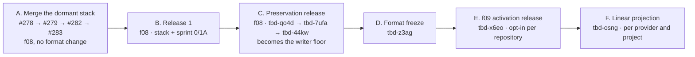

# Plan: Stability Sprint: Spec Lifecycle, Triage Views, Bulk Contract, and Tracker Convergence

**Date:** 2026-09-07

**Author:** Joshua Levy (github.com/jlevy) with LLM assistance

**Status:** Active. Merged in #277 (2026-09-14) after a revision that checked every
tracker claim against the code on `main`, replaced the #265 and #267 root causes, and
added Phase 1B (one sync engine).
The coordination stack (#278, #279, #282, #283) merged the same day.
A follow-up revision (2026-09-14) adds the f08 compatibility contract that every sprint
fix must satisfy and changes the 1a, 1e, 1f, and 1B designs to meet it.

**0.9.0 release reconciliation, 2026-09-16.** Phase 0 and the release-critical
convergence slice of Phase 1A shipped through PR #298; PR #299 published 0.9.0 at
`f005c19d`. The former blockers `tbd-bdkj`, `tbd-s4kb`, and `tbd-od0z` are closed.
The T3 gate establishes 0.9.0 as the minimum version for every clone that runs
integration sync, while exact slots, `In Review`, Paused, Duplicate, and unavailable
workflow states now settle or report a bounded skip.
The remaining Phase 1A, 1B, spec lifecycle, CLI ergonomics, and coordination beads stay
active for later releases.
A controlled 0.9.0 Linear preview on 2026-09-16 found no recurrence of the historical
13-pair status oscillation.
The explicit sync then applied only the eight expected existing-bead updates, and a
repeat explain-preview showed no remaining pushes, pulls, creates, or divergences.
The obsolete mechanism and mirror-confirmation beads are closed.

**Linear convergence update, 2026-09-15 (#290).** The outbound adapter now writes the
canonical slot, including on create, and suppresses bead rewrites when an inbound
projection changes no persisted field.
The regression suite proves that a blocked epic is created in Backlog and produces no
later provider mutations across runs 2 through 9. The maintained live QA playbook adds
the same create-and-settle check against the OS team’s `tbd` project.
This fixes the #265 slot-alternation mechanism, but does not close the wider Phase 1A
work, the mixed-version T3 gate (`tbd-s4kb`), or the reporter-mirror confirmation
(`tbd-xn8m`).

**Release-readiness reconciliation, 2026-09-14 (`main` @ `52d5c2f7`).** Phase 0 has
*not* landed. `claude/tbd-sync-bugs-review-f1qb1f` still carries three unmerged commits
(`936909fe`, `ed45804a`, `4d23edcf`), including the settled-mirror fix, and no pull
request was ever opened for it, so 0b is not merely unreviewed — it is unsubmitted
(`tbd-bdkj`). Its spec, `plan-2026-08-28-sync-convergence-and-stability.md`, therefore
exists only on that branch while 25 open beads name it; `tbd update --spec` cannot even
set that path from `main` (#273), which had to be worked around by checking the file out
of the branch during this pass.

Two consequences for the rollout plan below.
First, its own rule — no release cut from `main` before 1a lands, because #264 widened
the #265 loop — is unmet, and 1a (`tbd-od0z`) is open.
Second, the stack merged with `tbd-s3zx` unfixed, so what the compatibility review filed
as a pre-merge follow-up is now a **shipped regression**: the comment union runs on
every `extensions` namespace whose two sides both lack an `id` (`file/git.ts:698-701`),
and `unionCommentArrays` drops non-object entries (`lib/comment-union.ts:42`), so a
third-party `extensions.<ns>.comments` array of strings is emptied by any structured
merge. Reproduced on `52d5c2f7`; absent from 0.8.1. Release 1 is blocked on fixing it on
`main`, not on rebasing a branch.

**Tracked as:** epic `tbd-ct4z`. Beads created for this plan carry `--spec` and sit
under the epic. Beads that already belong to another arc (`tbd-bcss`, `tbd-dzme`) keep
their spec and parent and are referenced here by ID.

## Overview

Eight issues were filed on 2026-09-07 from one reconciliation pass over a large
repository ([#269](https://github.com/jlevy/tbd/issues/269) through
[#276](https://github.com/jlevy/tbd/issues/276)). Ten older issues were already open.
Read together, the eighteen describe five underlying defects, not eighteen feature
requests:

1. A bead’s spec link is a path validated once against one checkout and never maintained
   afterward, while specs move between lifecycle folders and live on branches as a
   normal part of the process.
2. `tbd list` projects a flat, open-only, text-first view, so aggregate facts (how many
   children does this epic have, is this bead linked to a tracker) are not available to
   agents without scratch scripting.
3. The bulk-update contract refused two shared-value fields as if they were per-issue
   fields, so a spec move is dozens of single calls.
4. The tracker has two sync engines that disagree, and the reconciler’s status mapping
   does not round-trip: open work that is not ready is written to Todo and read back as
   a change, and a duplicate is written as a cancel.
   Around that, standing conditions count as pending work, and the umbrella `tbd sync`
   hides the tracker report and names a flag it does not have.
5. The CLI trusts its environment: it can resolve to another repository’s database and
   run under the wrong Node with a misleading diagnosis, each silently.

This plan fixes the five defects and, in doing so, closes or resolves fourteen of the
eighteen issues. Three of the remaining four are already fixed on `main` and only need
closing; one is the state model’s next phase and stays in its own spec.

The plan builds on the unmerged 2026-08-28 stability branch, which fixed the reporting
half of [#265](https://github.com/jlevy/tbd/issues/265) but not the alternation.
Landing that branch, after the CI fix in [#280](https://github.com/jlevy/tbd/pull/280),
is Phase 0.

Every claim below about current behavior cites the code that produces it.
Where a cause is inferred rather than confirmed, the text says so.

## Issue Map

| Issue | Root cause | Phase | Disposition |
| --- | --- | --- | --- |
| [#269](https://github.com/jlevy/tbd/issues/269) bulk `update` refuses `--parent` and `--spec`; no `spec move` | 3, 1 | 3, 2 | Fix |
| [#270](https://github.com/jlevy/tbd/issues/270) no epic view with total versus open children | 2 | 3 | Fix |
| [#271](https://github.com/jlevy/tbd/issues/271) `list --specs` open-only; no `--linked` filter | 1, 2 | 2, 3 | Fix |
| [#272](https://github.com/jlevy/tbd/issues/272) `max_nesting` skips deep epics silently | 4 | 1A | Fix |
| [#273](https://github.com/jlevy/tbd/issues/273) `update --spec` validates against one checkout | 1 | 2 | Fix |
| [#274](https://github.com/jlevy/tbd/issues/274) `update-specs-status` shortcut’s two wrong instructions | 1, 2 | 5 | Fix, after 2 and 3 |
| [#275](https://github.com/jlevy/tbd/issues/275) doctor misses three kinds of spec drift | 1 | 2 | Fix |
| [#276](https://github.com/jlevy/tbd/issues/276) full sync hides pending updates; no `--yes` | 4 | 1A, 1B | Fix; the “174 updates” count is the mirror’s, removed in 1B |
| [#267](https://github.com/jlevy/tbd/issues/267) valid duplicate close rejected on the Linear path | 4 | 1A | Fix by the round trip (1a), not by clearing the pointer |
| [#265](https://github.com/jlevy/tbd/issues/265) Linear sync never converges | 4 | 0, 1A, 1B | Land the branch; fix the round trip (1a); `--push` counts and overwrite in 1B; confirm on the reporter’s mirror (0c) |
| [#204](https://github.com/jlevy/tbd/issues/204) repo resolution crosses git boundaries | 5 | 4 | Fix (`tbd-pjan`) |
| [#254](https://github.com/jlevy/tbd/issues/254) session hook shadows Node, misreports the cause | 5 | 4 | Fix (`tbd-fnwc`) |
| [#179](https://github.com/jlevy/tbd/issues/179), [#180](https://github.com/jlevy/tbd/issues/180) CI-watch reminder on `gh pr create` | surfaces | 5 | Fix; #180’s remaining asks, including a Codex hook bug, split to `tbd-du2x` |
| [#181](https://github.com/jlevy/tbd/issues/181) forked-shortcut customization workflow | surfaces | 5 | Fix, docs plus one setup change; remaining asks split to `tbd-ddsp` |
| [#238](https://github.com/jlevy/tbd/issues/238) SKILL.md does not say beads live on `tbd-sync` | surfaces | 5 | Already fixed (`skill-baseline.md:148`); close |
| [#255](https://github.com/jlevy/tbd/issues/255) bootstrap points at the broker consequence | surfaces | 5 | Already fixed (`ensure-gh-cli.sh:264-270`, `skill-baseline.md:180`); close |
| [#195](https://github.com/jlevy/tbd/issues/195) gh guidance never reaches agents | surfaces | 5 | Criteria 1-3 fixed (`setup-github-cli.md:192`, `setup.ts:1021`); criterion 4 open under `tbd-mslv`; close citing both |
| [#244](https://github.com/jlevy/tbd/issues/244) state model: canceled, duplicate, hold | model | 1A | Own spec (`plan-2026-08-18-tracker-state-model-and-linear-mapping.md`); this plan implements its slot table outbound (1a) and corrects three checkboxes |
| [#246](https://github.com/jlevy/tbd/issues/246) actor axis | model | none | Own spec (`plan-2026-08-18-actor-axis-and-identity.md`), epic `tbd-f2kv` in progress |

## Goals

- **A spec link survives the spec’s lifecycle.** A bead whose spec moved folders, lives
  on an unmerged branch, or was duplicated is classified as such by one resolver, and
  doctor, `tbd spec status`, and `list --specs` all say the same thing about it.
  A spec move is one command that moves the file, rewrites inbound links, and repoints
  beads.
- **Epic and spec triage are single calls.** “Is this epic finished or never
  decomposed?” and “which active specs have no open bead?”
  are answered by one command each, in text and JSON, without reading bead files.
- **The bulk contract is the rule it claims to be.** Any flag whose one value applies to
  every ID works in bulk.
  The refusal message and the design doc list the same set.
- **Every board position round-trips.** What tbd writes to Linear reads back as the same
  position, so a pair that agrees stays quiet, a person’s column is not dragged, and a
  duplicate stays a duplicate.
- **A settled mirror reports itself settled, and an unsettled one says why.** Standing
  conditions are reported as exclusions, never as pending work.
  `tbd sync` prints the same tracker line as `tbd integration sync`, names the blocking
  cause, and accepts `--yes`.
- **One sync.** `--push` and `--pull` choose which half of one reconciled plan to apply;
  no flag silently overwrites the tracker, and the one deliberate overwrite is named.
- **tbd never operates silently in the wrong place.** A cwd inside repository A cannot
  resolve to repository B’s database; a foreign-prefix ID is an error; the session hook
  runs under the Node the session chose and names the real cause when it cannot.
- **Agent-facing instructions match the tool.** The `update-specs-status` shortcut uses
  the commands this plan adds and is pinned by a test.

## Non-Goals

- **The state model’s remaining unchecked items**
  ([#244](https://github.com/jlevy/tbd/issues/244); #283 re-audits that spec’s
  checkboxes) beyond the outbound slot mapping and the three corrections in 1a, and
  **the actor axis** ([#246](https://github.com/jlevy/tbd/issues/246)). Both have active
  specs and touch the same adapter surfaces; landing them on top of a reconciler that
  has just reached a fixed point is a separate decision.
- **The coordination plan’s phases**
  (`plan-2026-09-06-bead-coordination-and-native-comments.md` on #278). Its comment
  delivery identity (`tbd-6vg5`) and Linear comment projection (`tbd-osng`) edit
  `runSync` too; see “Relationship to the Coordination Stack”.
- **Phases 2 and 3 of the 2026-08-28 stability plan** (lock recovery, test-gate
  integrity, wall-clock flakes).
  They stay in that plan.
- **A GitHub tracker adapter**, `tbd -C <path>`, and repo identity in every `--json`
  payload. The last two are filed as follow-on beads; see Phase 4.
- **Performance work** on the sync path (`tbd-iqgm`).

## Background: Five Root Causes

### 1. A spec link is a path, validated once, then abandoned

`spec_path` is validated at write time only, by `resolveSpecArg`
(`lib/project-paths.ts:263-290`): a literal path is checked with `fs.access` against the
working tree (`project-paths.ts:182-200`), and a bare filename is matched against every
`.md` under `docs/` (`SPEC_SEARCH_ROOT`, `project-paths.ts:229`). Nothing in the
codebase validates a *stored* `spec_path` afterward: `grep spec` in `doctor.ts` returns
only two comment citations.

Meanwhile the process moves specs.
The Speculate layout has `active/`, `done/`, `future/`, and `paused/` lifecycle folders,
and a plan is expected to move between them.
The reporter measured the result on one pass: 279 of 941 beads carrying a `spec_path`
named a file that had moved, 213 of them repairable mechanically because exactly one
file of that basename existed elsewhere; 30 of 137 open epics had no `spec_path` at all;
one plan sat in both `active/` and `done/` for weeks with beads pointing at both
([#275](https://github.com/jlevy/tbd/issues/275)). Doctor reported the repository
healthy throughout.

The read side already treats the basename as the spec’s identity: `matchesSpecPath`
(`lib/spec-matching.ts:31-65`) matches on exact path, then suffix, then bare filename,
and `resolveSpecArg` searches by basename.
The `plan-YYYY-MM-DD-name.md` convention makes basenames unique in practice.
What is missing is applying that identity *after* the write: repointing a moved spec,
reporting a duplicated one, and recognizing one that exists on another branch.
The last case is the branch-store mismatch behind
[#273](https://github.com/jlevy/tbd/issues/273): beads live in a branch-independent
store shared through the git common directory, while a spec lives in one branch’s tree,
so validating against one checkout is a category error.
The only git-backed existence check today is `findBranchContaining`
(`integrations/core/permalink.ts:75-90`), used for permalinks.

The `update-specs-status` shortcut compensates for all of this by hand
(`update-specs-status.md:154-161`, `:170-184`, `:233-238`), which is how
[#274](https://github.com/jlevy/tbd/issues/274) found two of its instructions wrong in
practice.

### 2. `list` is a flat projection of open beads, designed for text

The `list` JSON projection (`cli/commands/list.ts:80-98`) emits `id`, `internalId`,
`parentId`, `priority`, `status`, `kind`, `title`, `description`, `assignee`, `labels`,
`spec_path`, and `child_order_hints`. It omits `extensions`, so a tracker link cannot be
filtered on; `parentId` is a display id while `child_order_hints` are internal ids, so a
consumer joining them against `id` gets zero children for every epic (the shortcut
warns: “if every epic looks closable, that is the bug”, `update-specs-status.md:243`).
`--specs` grouping lives only in the text formatter (`list.ts:108-112`, `:145-189`), so
`--specs --json` silently emits the flat array.
Closed beads are excluded unless `--all` (`lib/issue-query.ts:124`), which is correct,
but nothing counts children across both states, so an epic whose children all closed and
an epic that never had children look identical
([#270](https://github.com/jlevy/tbd/issues/270)). Triaging 137 epics with
`tbd list --all --parent <id> --count` is 274 calls.

### 3. The bulk contract confused shared-value fields with per-issue fields

`runBulk` (`cli/commands/update.ts:313-349`) refuses `--parent` and `--spec` alongside
`--title`, `--description`, `--notes`, `--notes-file`, `--from-file`, `--status`, and
`--child-order`. The first two take one value that applies identically to every ID,
exactly like `--priority`. The single-issue path adds three side effects the bulk loop
lacks: the cycle and depth check (`update.ts:176-195`, `lib/issue-hierarchy.ts:52-83`),
spec inheritance from the new parent (`update.ts:203-213`), and appending to the new
parent’s `child_order_hints` (`update.ts:239-255`). That append is copy-pasted in
`create.ts:222-238` and `integration-runner.ts:623`, and nothing anywhere removes a
child from its *old* parent’s hints (`schemas.ts:300-303` documents the resulting stale
ids). Three sources of truth already disagree about the allowed set: the code message
(`update.ts:344-347`), the design doc prose (`tbd-design.md:3020-3022`, which omits
`--delegate` and `--hold`), and the flag table, which also lacks `--spec`. #283 rewrites
that part of the design doc and adds all three, so after it merges the code message is
the one source left to reconcile.

### 4. Two sync engines, a status mapping that does not round-trip, and a report that hides both

Seven defects. The first two write wrong data to the tracker or to beads; the rest hide
that from the operator.

**The status mapping does not round-trip, so some pairs have no fixed point.** The
reconciler compares board positions (slots).
The local slot comes from `status`, `hold`, `resolution`, and readiness (`localViewOf`,
`sync-engine.ts:209-231`). Readiness is `readyIssueIds` (`lib/issue-selection.ts`),
which excludes an open bead that is delegated, held, deferred into the future, or
blocked by an open `blocks` dependency.
The state-model spec puts open, not-ready work in Linear’s Backlog and moves it to Todo
when it unblocks (`plan-2026-08-18-tracker-state-model-and-linear-mapping.md:206`,
`:216-218`). The outbound path never implemented that.
It decomposes the slot back into bead fields (`sync-engine.ts:781-785`, `decomposeSlot`
at `slots.ts:158-178`), which collapses `backlog` and `todo` into plain `open`, and the
adapter maps `open` to the `unstarted` state type (`statusToLinear`,
`linear/mapping.ts:80-93`), which is Todo.
Todo reads back as `todo` (`slotFromLinear`, `mapping.ts:345-387`). `slotToLinear`
(`mapping.ts:398`) is the required outbound inverse.
Before #290, it had no caller; #290 routes slot-bearing create and update patches
through it.

For a linked, open, not-ready bead with no hold, that is a two-run cycle once the link
record holds an exact slot.
A record written by the create or import path has no slot, so its first run compares
bands only and stores the local slot (`reconcile.ts:254-265`); the cycle starts on the
next run:

| Run | Local | Base | Remote | Engine decision |
| --- | --- | --- | --- | --- |
| n | `backlog` | `backlog` | `todo` | remote changed: pull; the bead is rewritten with no field change; base becomes `todo` |
| n+1 | `backlog` | `todo` | `todo` | local changed: push `open`; Linear stays in Todo; base becomes `backlog` |
| n+2 | `backlog` | `backlog` | `todo` | same as run n |

`tie_break` plays no part, because only one side differs from base on each run
(`reconcile.ts:478-481`), and the count is stable because the set is exactly the linked
beads in that condition.
This fits every measurement in [#265](https://github.com/jlevy/tbd/issues/265): after a
pull run, base equals the bead, `base.slot` equals `refinement_slot`, and
`remote_updated_at` equals live Linear.
The mechanism is confirmed from the code and not yet reproduced in a test.
The 2026-08-28 investigation did not reach it because its round-trip tests use ready
beads. The deciding check on the reporter’s data needs no new code: the 13 pairs should
be exactly the linked open epics without a hold that `tbd ready` omits, and they should
sit in Todo. Since [#264](https://github.com/jlevy/tbd/pull/264), `main` also treats a
future `deferred_until` as not ready, so a release cut from `main` as it stands widens
the set.

The same asymmetry has three more instances, and the create path shares it:

- **Duplicate close ([#267](https://github.com/jlevy/tbd/issues/267)).** The outbound
  decomposition turns slot `duplicate` into resolution `canceled` (`slots.ts:162-164`),
  so Linear receives a Canceled state while the base records `duplicate`. The next run
  reads `canceled`, sees only the remote as changed, and pulls `resolution: canceled`
  (`sync-engine.ts:802-818`) onto a bead that still carries `duplicate_of`. `writeIssue`
  rejects the record (`lib/schemas.ts:392-397`, `file/storage.ts:74-77`), the per-pair
  catch records the failure before the base advances (`sync-engine.ts:1440`,
  `:1473-1480`), and every later run repeats it.
  The reporter’s guess, that a partial projection is validated, is not what happens: the
  only parse sites are `storage.ts:74` and `parser.ts:104`. Clearing `duplicate_of`
  whenever a patch carries another resolution would make the sync succeed by converting
  the duplicate into a cancel and deleting the pointer, so that rule cannot ship without
  the round-trip fix.
- **A column a person chose.** An issue moved to In Review is pulled (base becomes
  `in_review`), then pushed back as `in_progress`, which the adapter resolves to the
  team’s In Progress state by conventional name (`mapping.ts:295-298`). The card is
  dragged out of the column and the pair then settles.
  The refinement replay (`sync-engine.ts:795-801`) cannot prevent it: it fires only when
  the recorded refinement equals the outbound slot, and in the started band the outbound
  slot is always `in_progress`. The test that pins this behavior
  (`tests/integrations-sync-engine.test.ts:938-965`) stops at the second run, before the
  drag.
- **A state the team cannot resolve.** `adapter.ts:1030-1032` sets `stateId` only
  `if (stateId)`, with no `else`. The update succeeds and the pair counts as pushed
  while the column never moves, which turns any in-band difference into a permanent loop
  on that team.
- **Create.** The engine’s `createIssue` call sends `status` without `resolution` or
  `hold` (`sync-engine.ts:1527-1551`), so a canceled bead is created as Done and a held
  bead lands in Todo. It also checks `adapter.canPushAssignee` without the
  `field_sync.fields.assignee === 'merge'` gate the pair path applies (`:730-738`),
  which reopens the OS-351 leak for newly created items.

**There are two sync engines.** Bare `tbd integration sync` and `--pull` run the
three-way reconciler (`runSync`, `sync-engine.ts:367`). `tbd integration sync --push`
and `tbd sync --push --integrations` run the one-way mirror from the first integration
phase (`planMirror` and `applyMirror`, `integrations/core/mirror.ts:209`, `:369`), which
was renamed `--push` when reconciliation shipped
(`plan-2026-08-10-external-tracker-integrations.md:399-404`). The mirror reads nothing
back for merging and writes no base; it refreshes only the stored key and URL
(`cli/lib/integration-runner.ts:484-495`). The consequences:

- It puts every selected linked bead into `updates` whether or not anything changed
  (`mirror.ts:331-335`) and sends title, status, resolution, hold, and priority
  (`mirror.ts:262-296`). That is the “would update 136” in #265 and the “174 updates”
  refusal in [#276](https://github.com/jlevy/tbd/issues/276), and each real run bumps
  every item’s `updatedAt`.
- It overwrites a Linear-side edit to any of those fields, and the next reconcile run
  sees remote equal to local and records nothing: no conflict, attic entry, or overwrite
  line. `setup-linear.md:208` warns about this; the reporter in #276 ran it with `--yes`
  over 173 items.
- It disagrees with the reconciler on the same bead: a duplicate goes to Linear’s
  Duplicate state instead of Canceled, no `stateId` is sent so issues leave team
  columns, and a parent outside the selection is written as `parentId: null`
  (`mirror.ts:250-274`), so `--push --bead <child>` detaches a sub-issue that the next
  bare sync reattaches.
- Its creates are not journaled: a crash between create and link leaves an unlinked
  tracker item (`mirror.ts:344-348`) that the next run creates again.
- The selectors (`--bead`, `--type`, `--status`, `--label`, `--spec`, `--limit`) exist
  only on this path (`cli/commands/integration.ts:879-882`), which is why the bulk
  guard’s remedy names flags the bare sync rejects.

**Exclusions count as work.** A bead deeper than `max_nesting` within the outbound
selection is skipped (`integrations/core/sync-engine.ts:887-902`, `mirror.ts:227-239`),
and the skip set is a term in both `nothingToDo` computations (`sync-engine.ts:1076`,
`:1678-1692`). The skip is recomputed from the issue graph on every run and nothing can
change it except re-parenting or a policy change, so a repository with one permanently
deep bead can never report `nothing to do`
([#272](https://github.com/jlevy/tbd/issues/272)). The 2026-08-28 plan found the same
shape in a standing mapping warning and fixed it (`tbd-p40p`); the nesting skip is the
next instance, and a skipped push under the default `assignee: local` is a third.

**Three printers, three vocabularies.** `printSyncReport`
(`cli/commands/integration.ts:540-586`) prints `would push / would pull / skipped`,
where `skipped` never takes the `would` prefix; the mirror-only printer
(`integration.ts:437-476`) prints
`created / updated / skipped / fields not pushed / failed`; the fold inside `tbd sync`
(`cli/commands/sync.ts:353-394`) prints
`would push / would pull / would create / conflicts / failures` and omits `skipped`
entirely, and prints only under `--verbose` on `main` (`output.ts:419-423`). So the run
an operator actually performs at session end is the one that cannot show a nesting
exclusion.

**The blocked run cannot say what is behind it.** `reports` is declared inside the `try`
in the fold (`sync.ts:1231-1243`) and is out of scope in the `catch` (`:1246-1256`), so
the warning has only the error message: one failing item, or the bulk-guard refusal.
The engine’s bulk guard refuses before any pair is attempted
(`sync-engine.ts:1008-1020`, `bulk-guard.ts:34-62`) but after journal replay
(`sync-engine.ts:435`), so a refused run may already have written replayed intents.
Its remedy says “Re-run with `--yes`”, but `tbd sync` has no `--yes`
(`sync.ts:1548-1563`); under the default `on_tbd_sync: guarded` posture
(`provider-settings.ts:181-214`) the fold runs with `assumeYes: false`, so an oversized
run fails with advice for a different command (#276). The “174 updates” refusal the
reporter then hit comes from the mirror’s separate guard
(`integration-runner.ts:423-439`), which counts unchanged items.
`assertIntegrationReportsHealthy` names only the first failure (`sync.ts:397-414`).

**Two smaller honesty gaps.** The git summary counts only the commit made before the
fold (`sync.ts:1116-1120`), not the fold’s own `tbd integration: sync` commit, so a
`tbd sync` that pulled 13 beads prints `Already in sync` (`sync.ts:1384-1391`). And a
pulled description containing a `## Notes` heading is split at that heading on read-back
(`file/parser.ts:78-85`), so the next run pushes the truncated prose: it converges in
two runs, but loses text.

**What the 2026-08-28 branch fixed, and what it did not.**
`claude/tbd-sync-bugs-review-f1qb1f` (three commits, seven files, +785/−9) makes the
fold print its tracker line at default verbosity (`tbd-10zb`), stops a standing mapping
warning from holding `nothingToDo` false forever (`tbd-p40p`), makes dry-run and execute
agree on direction and populates `skippedPushes` on dry runs (`tbd-r1a3`, `tbd-8gcz`),
teaches the mock server to apply `stateId` on create, and ships
`tbd integration sync --explain` (`tbd-aypl`). `git merge-tree` reports no conflicts
with `main` or with any open PR. None of its changes touch the slot logic, and a review
found four gaps:

- The dry-run `nothingToDo` never counted `orphaned`. With the warnings term removed, a
  reopened pair whose tracker item is archived dry-runs as nothing to do and prints no
  orphan line.
- With the default `assignee: local` (`lib/schemas.ts:744`), a bead whose assignee
  differs from Linear’s is a skipped push on every run.
  Once dry runs report skipped pushes, the dry run never reports settled either: the
  standing-condition shape `tbd-p40p` fixed for warnings.
- `--explain` names the field, direction, and rule but not the local, remote, and base
  values its spec promised, so it cannot show a `backlog`/`todo` or
  `duplicate`/`canceled` flip.
  It is ignored with `--push`, and a pair dirty only because of its managed block gets
  no line.
- Its five beads are closed although the code is not on `main`.

### 5. The CLI trusts its environment

`findTbdRoot` (`file/config.ts:281-298`) walks from cwd to the filesystem root looking
for `.tbd/config.yml` with no git sentinel, so a nested repository without `.tbd/`
resolves to the enclosing repository’s database, reports it under the inner path, and
materializes the outer repository’s hidden worktree and locks, exit 0
([#204](https://github.com/jlevy/tbd/issues/204)). `extractShortId`
(`lib/ids.ts:181-184`) strips any alphabetic prefix without comparing it to the
repository’s, so `tbd show zzz-fiba` returns `fsq-fiba`, and on a short-id collision a
bulk `close` mutates the wrong repository’s issue.
Both of those commands, and `update`, `reopen`, `pause`, `--parent`, `dep`,
`integration`, `attic`, and `board`, resolve IDs through `resolveAllIds` and
`resolveToInternalId` (`file/id-mapping.ts:556`), not `resolveIssueId`, so a check
placed in `resolveIssueId` would miss both examples.
`tbd status` prints cwd under `Repository:` (`status.ts:109` sets `working_directory`;
`sections.ts:89` prints it) where doctor prints the resolved root.

The generated session hook prepends `/usr/local/bin` to `PATH` (`setup.ts:304`, `:426`,
`docs/install/ensure-gh-cli.sh:31`), demoting a newer Node the session placed first;
`tbd_local_can_read_repository()` (`setup.ts:281-283`) cannot distinguish “Node too old”
from “format incompatible” because it discards stderr, so it prints a format diagnosis
for a Node failure; and the `npx` fallback runs under the same Node, so it cannot
recover ([#254](https://github.com/jlevy/tbd/issues/254), confirmed again on 0.8.1 on
2026-09-05). Both defects have beads under earlier plans (`tbd-pjan`, `tbd-fnwc`) and
neither has shipped.

## Relationship to the Coordination Stack

Five PRs formed one stack: #280, then #278, #279, #282, and #283. #280 merged first, on
2026-09-14, to unblock CI’s audit step.
The other four merged together in `9753fad5` the same day, after restacks that left each
reviewed tree unchanged and one docs-only commit on #283 (`4a42a6ac`) recording the
landing gates in the coordination plan.
`main` CI passed on the merge.
Landing was tracked as `tbd-m88s`, with one child bead per layer (`tbd-o2ob`,
`tbd-8rnq`, `tbd-g58e`, `tbd-w3tv`, all closed).
#279 merged before its three gates closed, so they now apply to `main` and gate Release
1 instead (see below).
The table records what each PR changed:

| PR | What it changes | Reachable today | Effect on this plan |
| --- | --- | --- | --- |
| [#280](https://github.com/jlevy/tbd/pull/280) | js-yaml overrides for CVE-2026-84375 | a merge-sequence cap only | **Required first**: CI’s `pnpm audit --prod` step has failed on every PR without it since 2026-09-08 (Phase 0a) |
| [#278](https://github.com/jlevy/tbd/pull/278) | coordination research and plan; status rewrites in the 08-10, 08-14, actor-axis, and state-model specs; one paused spec and three research briefs archived | no code | adds an `archive/` specs folder Phase 2 must classify; 92 beads point at its plan, an on-branch case until it merges |
| [#279](https://github.com/jlevy/tbd/pull/279) | provider comment arrays merge only within one link lineage (`commentsShareLinkLineage`, `file/git.ts:694`) | yes, after every `mergeIssues`: normal sync merge, rescue, and workspace import | none for this plan; its own review should ask for a test of the ordinary three-way sync merge with differing lineage |
| [#282](https://github.com/jlevy/tbd/pull/282) | dormant native comment records; `parseFrontmatterDocument` extracted in `file/parser.ts` | the parser refactor only | 1f edits two lines below the refactor; a trivial conflict at most |
| [#283](https://github.com/jlevy/tbd/pull/283) | dormant inventory code; the `agent_map` fix (`21caa23a`); message text; rewrites of `tbd-design.md`, `tbd-docs.md`, `skill-baseline.md`, and the SKILL.md copies; a checkbox audit of the state-model and tracker specs; three specs moved to `done/` or `archive/` | the `agent_map` fix and message text | docs items and checkbox corrections land after it; its moves repoint 36 beads to paths that exist only on its branch |

Neither #282’s nor #283’s new code changes a persisted format: the native comment and
inventory modules are imported only by each other, their tests, and the benchmark
script, and nothing writes under `.tbd/data-sync/comments`.

**Release compatibility.** A review of every change the stack makes reachable
(2026-09-14) found no format or read-path break: the parser refactor is equivalent, the
new ID helpers are additive, and the native-comment modules are unreachable from the CLI
and library entry points.
It found five follow-ups, each a bead:

- #279’s comment union runs on every `extensions` namespace with a `comments` array, so
  a merge silently rewrites third-party data (`tbd-s3zx`), and the `tbd sync` and
  merge-refs paths have no differing-lineage test (`tbd-apnu`). Its High review finding
  fix has no independent re-review (`tbd-cskr`). #279 merged before these closed, so
  they now gate Release 1.
- `tbd sync` prints “conflict(s) preserved in attic” but writes no attic entry, which
  #279 and #283’s docs now rely on (`tbd-ajq2`, pre-existing, a release blocker).
  Decided: sync always saves every conflict’s losing value to the attic, and the attic
  is documented as an extra, append-only recovery store with restore steps.
- With #283’s `agent_map` fix, an invalid map fails integration commands (`tbd-tia7`),
  and a valid one sends `delegateId` on every push, closed beads included (`tbd-80vz`).
- `tbd status` names a nonexistent `tbd setup beads --disable` (`tbd-xzyh`,
  pre-existing), and the comment delivery docs omit the `tbd sync` fold (`tbd-af8w`).
- Release notes for the stack’s reachable changes (`tbd-lz1q`).

**After the merge.** The full sequence from here to activating the comment format is in
“Native Comment Work: Merge, Release, and Format Upgrade Map” below.
The sprint’s document edits that waited for #283 can now proceed: the state-model
corrections in 1a, the docs in `tbd-qeug`, `tbd-hspp`, and `tbd-owf9`, and the “nothing
to do” wording that `tbd-km3p` changes, which #283 documents as the steady state
(`tbd-docs.md` around `:2005` and `:2221`).

**Semantic dependencies.**

- **`agent_map`.** On `main`, `resolveProviderSettings` never fills `agentMap`
  (`provider-settings.ts:114-151`), so every delegate is skipped on push and inbound
  delegates read as null.
  The fix is three lines and can be cherry-picked alone if #283’s review is slow.
  Delegate is pushed only by the mirror today, so Phase 1B must port it (`tbd-9tj0`) or
  the fix becomes unreachable again.
  Once it works, a push sets Linear’s `delegateId`, which starts an Agent Session for
  that agent; that needs a release note.
- **State-model checkboxes.** At #283’s head, line 551 marks “unmapped names become
  owned refinements (band slot for the matrix…)” done, but the matrix compares exact
  slots once the base is exact (`slots.ts:242-244`), which is the defect 1a fixes; lines
  511 and 513 keep the duplicate relation items checked with no implementation
  (`tbd-vp4p`). 1a corrects all three on top of #283.
- **Coordination work in `runSync`.** `tbd-6vg5` (comment delivery identity, near
  `sync-engine.ts:1247`) and Phase 4 of that plan, `tbd-osng` (native comments projected
  to linked Linear beads), both edit the engine that Phases 1A and 1B restructure.
  1B’s planner classifies comment actions so `tbd-osng` adds a comment source rather
  than a second path. Sequence `tbd-6vg5` after 1a, or review the two together.
- **Tracking hygiene.** The coordination beads closed before merge now record merge
  commit `9753fad5`. The five 2026-08-28 beads stay closed with their code still on the
  unmerged branch; `tbd-bdkj` notes the merge commit when it lands.

## f08 Compatibility Contract for Sprint Fixes

Every fix in this plan ships without a format bump.
A compatibility review on 2026-09-14 checked each planned change against what 0.7.x and
0.8.x clients read, write, preserve, and replay when they share a repository, bridge
records, intents, and config with a newer teammate.
None of the changes needs f09; four needed design changes to stay safe, and those are
folded into the Design sections below.

### Why “no format bump” needs rules

Four facts about current clients decide what an f08 change may do:

- **Config survives only where every enclosing level keeps unknown keys.** `writeConfig`
  writes back the parsed object (`file/config.ts:216-222`). The top level,
  `integrations` and each provider block, `target`, `labels`, `identity`,
  `policy.outbound`, `policy.inbound`, `policy.field_sync`, and legacy `select` keep
  unknown keys in 0.7.0 and 0.8.1. `policy` itself does not (`PolicyDefinitionSchema`,
  `lib/schemas.ts:761-795`, deliberately not passthrough), nor do `sync`, `settings`, or
  `display`.
- **Bridge records drop fields they do not declare.** `BridgeBaseSchema` and
  `LinkRecordSchema` are plain objects (`lib/schemas.ts:611-687`), records are rebuilt
  on write (`sync-engine.ts:1433-1472`), and 0.7.0 declares no `base.slot` or
  `refinement_*` at all, so a 0.7.0 client already deletes them when it rewrites a
  record.
- **An intent a client cannot parse stops that provider’s sync.** `listIntentFiles`
  throws on a schema failure (`integrations/core/intents.ts:152-157`) and is read even
  on dry and `--pull` runs; unknown keys inside a patch are kept (`intents.ts:30-40`).
- **The bead parser is shared history.** 0.7.0 and 0.8.1 split a body at the first
  `/(^|\n)## Notes\n/i` after trimming (`file/parser.ts:71`, `:78`, `:131`); a client
  that parses differently truncates or corrupts what another client wrote.

### Rules

1. No `CURRENT_FORMAT` change and no new bead keys.
2. A new config key lives only at a level that keeps unknown keys in 0.7.0.
3. No new bridge-record fields and no new meaning for existing ones.
   If a field is unavoidable, it is optional, and its absence means “derive it”.
4. No new intent op kinds; reuse `create_issue`, `update_issue`, `upsert_attachments`,
   and `splice_description`. Journaled patches always carry `status`, `resolution`, and
   `hold`, never `slot` alone.
5. The parser does not change.
   A writer-side encoding must read back identically in the 0.7.0 and 0.8.1 parsers and
   leave the description hash unchanged.
6. Attic entries are written only through `writeAtticEntryFile`, into the flat `attic/`
   directory that `tbd attic list` reads (`cli/commands/attic.ts:92`).
7. A change to what tbd writes to Linear passes the mixed-version convergence test (T3).
   If it cannot, it ships opt-in or with a stated minimum version for every clone that
   runs integration sync.
8. A change to a generated script updates the upgrade proof’s expectation in the same PR
   (`scripts/validate-upgrade-package.mjs:394-401` requires `tbd-session.sh` to be
   unchanged for a compatible upgrade).
9. A JSON shape change that is not additive is opt-in or named in the release notes.

### Checks every sprint PR passes

CI already runs `qa:upgrade-package` on every PR (`.github/workflows/ci.yml:54-56`). It
proves that the candidate keeps unknown top-level and provider-level config keys, that
the format stamp is unchanged, and that setup does not touch issue data.
It does not prove that an old client can read what the candidate writes: the 0.7.0
client only runs `status` afterward, nothing exercises beads, bridge records, intents,
or the attic, and 0.8.1 is not a baseline.
Four new tests close that gap:

| Test | Bead | Proves | Gates |
| --- | --- | --- | --- |
| T1 | `tbd-3dti` | the newest published f08 release is a second baseline; the old client’s `config set` and `setup --auto` keep keys the sprint adds at their nesting level, with a `policy.<sibling>` negative control (done 2026-09-14: `validateOldClientConfigRoundTrip` in `validate-upgrade-package.mjs`, probing top level, `identity`, and `policy.outbound`; the baseline is `TBD_UPGRADE_LATEST_FORMAT_FROM`, defaulting to the newest npm release and packed separately even when its manifest version matches the candidate; every sprint PR adding a key adds a probe at that key’s level) | 1e, Phase 2 `specs.dir` |
| T2 | `tbd-stdj` | the 0.7.0 exported parser and schemas read candidate-written beads (including `## Notes`), link records, and config identically, with the stored description hash unchanged (done 2026-09-14: `validateOldParserRoundTrip`. Byte identity is deliberately NOT asserted — 0.7.0 keeps unknown bead fields but writes them last, since its field order does not name them. The link-record drop list is asserted as an EXACT set — `refinement_state_id`, `refinement_slot`, `base.slot` — so a new bridge-record field fails the gate until its minimum-version consequence is recorded) | 1f, any bridge-record change |
| T3 | `tbd-s4kb` | packed 0.8.1 and the candidate alternating `tbd integration sync` against the Linear mock converge by run 4 on a blocked epic, a future-deferred epic, an In Review item, a team without Backlog, a #267 pair seeded by 0.8.1, a flattened child, and one 0.8.1 `--push` | 1a, 1e, Phase 1B |
| T4 | `tbd-9fpp` | a same-format baseline clone merges and reads candidate-written attic entries, and preserves bridge records and journaled intents, across a two-clone `tbd-sync` merge (done 2026-09-14: `validateCrossVersionCoexistence` in `validate-upgrade-package.mjs`; the baseline is the *oldest* published f08, currently 0.7.0, which is the weaker client and so the stronger test; whether an older *reader* accepts candidate-written intents needs credentials and stays with T3) | `tbd-ajq2`, Phase 1B |

Existing checks stay required: `pnpm --filter get-tbd test`, `pnpm qa:upgrade-package`,
`tests/cli-format-compatibility.tryscript.md`, and the `cli-sync*` tryscripts.

### Per-change classification

| Change | Persisted surface | f08-safe? | Constraint |
| --- | --- | --- | --- |
| Phase 0 branch (reporting, `--explain`) | CLI and JSON only | yes | keep JSON additive; release-note ids moving from `pushed` to `suppressedPushes` |
| 1a slot round trip | Linear state; `base.slot` | yes, with the 1a changes below | keep `base.slot` in local vocabulary; seed-from-0.8.1 duplicate test; T3 |
| 1a duplicate pointer | existing bead fields | yes | the upgrade rule in 1a |
| 1a create path | Linear; journaled `create_issue` | yes | rule 4 |
| 1b, 1c, 1g reporting, guard order, `tbd sync --yes` | CLI and JSON; journal order | yes | no new op kinds; a refused run leaves the journal intact |
| 1d nesting notice and doctor check | none | yes | none |
| 1e `policy.outbound.deep` | nested config (kept by 0.8.1 under an inline policy object) | on disk yes; behavior no | every 0.7.x and 0.8.x sync re-sets linked parents (`sync-engine.ts:850-860`), undoing `flatten`; ships only with a minimum version for every writer, after T3 |
| 1f `## Notes` round trip | bead body bytes | yes, writer-side only | encoding in 1f; T2 |
| 1B one sync | Linear; bridge base values; intents | yes, if constrained | rules 3 and 4; attachment changes detected against the remote item; T3, T4 |
| `tbd-ajq2` sync attic entries | attic files | yes | rule 6; non-bead conflicts (link records, intents) need a representation list and restore can show; T4 |
| Phase 2 `specs.dir`, `--fix` repointing | top-level config; existing `spec_path` | yes | do not reinterpret `select.specs: active` relative to `specs.dir` (`lib/schemas.ts:557-563`) |
| Phase 3 bulk `--parent` and `--spec`; `--children`, `--linked` | existing bead fields; JSON | yes | `list --specs --json` groups are a breaking shape change: opt-in flag or release note |
| 4a git-boundary resolution | none (CLI) | yes | ship an escape hatch or a warning first: agents work inside nested clones such as `attic/<repo>` from `checkout-third-party-repo` |
| 4d generated hook scripts | generated surfaces | yes | rule 8; an old client’s `setup --auto` restores the old script, which is churn, not data loss |
| 5c honest setup exit | generated surfaces | yes | exit 1 only on a real write failure; the upgrade harness and bootstrap scripts require setup to succeed |

Already true today, and stated in Release 1’s notes: a 0.7.x client that runs
integration sync drops `base.slot` and `refinement_*` and leaves `resolution` set on a
reopened bead, so 0.8.1 is the minimum version for any clone that runs integration sync.

## Native Comment Work: Merge, Release, and Format Upgrade Map

The native comment work (`plan-2026-09-06-bead-coordination-and-native-comments.md`,
epic `tbd-khi1`) and this sprint share the sync engine and the release train, so this
section maps both onto one sequence.
The rule behind every step: no release changes what an existing repository stores until
every client that writes to it can preserve the new data, and the one step that does
change it is explicit, reviewed, and committed by a person.



| Stage | On disk | Older clients | What an existing repository does | Gates |
| --- | --- | --- | --- | --- |
| A. Merge the stack (done, `9753fad5`) | unchanged f08; no new files written | unaffected | nothing | carried into Release 1 |
| B. Release 1 | unchanged f08; attic entries from `tbd sync` (same entry format) | 0.8.x keeps reading and writing; 0.8.1 is the minimum for clones that run integration sync | `tbd setup --auto` refreshes generated agent surfaces; no migration | `tbd-lz1q`, `tbd-od0z`, `tbd-ajq2`, `tbd-s3zx`, `tbd-apnu`, `tbd-cskr`, `tbd-tia7`, `tbd-80vz`, f08 contract tests T1 to T4 |
| C. Preservation release | unchanged f08; every sync, merge, recovery, and doctor path preserves a `comments/` tree it does not yet use | still read and write, but do not preserve comment records | nothing; this release becomes the minimum for every writer | `tbd-76ad`: `tbd-qo4d`, `tbd-7ufa`, `tbd-44kw` |
| D. Format freeze | no release artifact | n/a | n/a | `tbd-z3ag` (with `tbd-q2w2` evidence) |
| E. f09 activation | f09 only after an explicit, committed enable | an f08-only client that has pulled the enable commit refuses before mutating | nothing until a maintainer enables it | `tbd-x6eo`, writer inventory, packed refusal and stale-clone proofs |
| F. Linear projection | embedded provider comments migrate into the native store per project | n/a (f09 repositories only) | nothing until projection is enabled for a provider and project | `tbd-osng`, `tbd-6vg5`, `tbd-bexc`, `tbd-iqgm` |

### A. Merge the dormant stack

Done: merged bottom to top in `9753fad5` on 2026-09-14 under `tbd-m88s`, with `main` CI
green on the merge.

| Layer | Bead | Outcome | Gates carried forward |
| --- | --- | --- | --- |
| #278 coordination plan and research | `tbd-o2ob` | merged, docs only | none |
| #279 embedded provider comments preserved through recovery | `tbd-8rnq` | merged before its gates closed | `tbd-s3zx` (scope the comment union to provider namespaces), `tbd-apnu` (sync and merge-refs lineage tests), `tbd-cskr` (independent re-review of the PR279-R1 fix), now Release 1 gates |
| #282 dormant native comment records | `tbd-g58e` | merged | none |
| #283 dormant inventory, `agent_map` fix, docs | `tbd-w3tv` | merged | `tbd-tia7`, `tbd-80vz` (Release 1) |

Why merging is safe for existing repositories, and the evidence for each claim:

- **No format change.** `CURRENT_FORMAT` stays f08 and fresh setup writes f08; the
  stack’s negative gate proves no native-comment CLI, export, runtime caller, config, or
  scaffold is reachable.
- **The read path is unchanged.** `parseFrontmatterDocument` behaves identically to the
  previous parser for every input class checked, including CRLF, BOM, missing
  frontmatter, `---` in the body, and YAML errors; the new ID helpers are additions.
- **Old clients still work.** CI’s packed upgrade proof (`qa:upgrade-package`) upgrades
  repositories created by 0.4.2, 0.5.0, and 0.7.0 and checks that the oldest f08 client
  reads what the candidate writes; it passed on #283’s code.
- **What does change** is reachable behavior, and each change is either fixed before its
  layer merges or tracked for the release: #279’s comment union rewrites third-party
  `extensions` data (`tbd-s3zx`, which did not close before merge and now gates Release
  1), #283’s `agent_map` fix makes invalid maps fail and valid maps send `delegateId` on
  every push (`tbd-tia7`, `tbd-80vz`), and `tbd sync` does not yet write the attic
  entries the new docs describe (`tbd-ajq2`).

Rollback: each layer is a merge commit and can be reverted; nothing it writes needs
migrating back.

### B. Release 1 (f08)

**Shipped as 0.9.0 on 2026-09-16.** Contents were `main` since v0.8.1 (#264, #266,
#280), the coordination stack, Phase 0, and the release-critical convergence slice of
Phase 1A. PR #298 closed `tbd-bdkj`, `tbd-s4kb`, and `tbd-od0z`; PR #299 published the
tag and package.
The complete package, downstream, hosted-CI, and live-Linear evidence is
recorded on `tbd-lz1q` and summarized in the top-level `TODO.md`.

Satisfied release gates:

- `tbd-od0z` has landed, because #264 already widens the #265 alternation on `main`.
- `tbd-s3zx`, `tbd-apnu`, and `tbd-cskr` have closed: #279 is on `main`, so its comment
  union already rewrites third-party `extensions` data during merges there.
- Every sprint fix in the release satisfies the f08 compatibility contract, including
  the tests T1 to T4 (`tbd-3dti`, `tbd-stdj`, `tbd-s4kb`, `tbd-9fpp`) for the changes
  they gate.
- `tbd-ajq2` has landed: `tbd sync` saves every merge conflict to the attic, and the
  attic is documented as an extra, append-only recovery store with restore steps.
- `tbd-tia7` has landed, or the release notes name the new `agent_map` failure;
  `tbd-80vz` is fixed or named.
- Release notes (`tbd-lz1q`) cover the `agent_map` behavior, upgrading every clone
  (comment lineage protection holds only when the merging client is upgraded), generated
  agent-surface churn between versions, and changed CLI strings.
- `pnpm qa:upgrade-package` and `pnpm release:verify` pass on the candidate, and because
  generated agent surfaces change, the packed candidate is validated in a fresh
  first-party downstream checkout, per `docs/development.md`.

User upgrade: `npm install -g get-tbd@latest`, then `tbd setup --auto` in each
repository and commit the generated-surface diff.
There is no format migration.
The T3 result is stricter than the earlier draft: every clone that runs
`tbd integration sync` must use 0.9.0 or newer.
Version 0.8.1 does not implement the exact-slot contract and is not a safe concurrent
integration-sync writer with 0.9.0.

### C. Preservation release (f08)

The preservation layers under `tbd-76ad` land in order: Git operation guards
(`tbd-qo4d`), workspace, outbox, and history recovery (`tbd-7ufa`), then doctor and the
compatibility gate (`tbd-44kw`). They make every broad stage, commit, fast-forward,
merge, push retry, workspace or outbox move, doctor repair, and unrelated-history rescue
preserve a `comments/` tree and its conflict evidence, while no native writer exists.

Why a separate release: Release 1 and 0.8.x clients neither read nor protect that tree.
Once native records exist, any such client can drop them through an ordinary broad
stage, repair, or rescue.
This release is therefore the minimum binary for every writer before stage E, and the
release notes say so in those words.

Evidence required: `qa:upgrade-package` gains a scenario in which a planted comments
tree survives every preserved path under the candidate, plus a record that the previous
release does not preserve it.
`tbd-qo4d` also decides partial-clone lazy fetch for the inventory reads, per the #283
review.

Coordination with this sprint: `tbd-ajq2` (attic writes on the `tbd sync` path, a
Release 1 gate) and `tbd-f99c` (the fold’s commit in the git summary, Phase 1A) change
the same Git sync code that `tbd-qo4d` guards.
Both are planned to land first, and `tbd-qo4d` then guards their writes.
Phase 1B changes how tracker work is planned, not the Git sync paths, so it can land
before or after the preservation layers.

### D. Format freeze

`tbd-z3ag` closes after the preservation evidence exists: the Phase 2 subset of the
`tbd-q2w2` experiments, the S282-01 syscall and error-path evidence and the S282-02
agent-ID grammar decision, and the scale case from the #283 review (50,000 records
classify within the benchmark target).
The selected representation and grammar are recorded before any f09 constant exists.

### E. f09 activation release

`tbd-x6eo` ships the only step that changes what a repository stores, and it is opt-in
per repository:

1. **Split `CURRENT_FORMAT`.** Today it is the readable ceiling, the migration target,
   and the fresh-repository default at once, so bumping it would auto-migrate every
   repository on `tbd setup --auto`. The release reads f09 but keeps f08 as the default
   and the migration target, and decides the common-directory layout and generated
   integration-marker semantics.
2. **Inventory writers.** Every clone that writes to the repository runs at least the
   preservation release.
   An unknown or older writer blocks activation, because Git cannot fence a stale clone
   that never pulls the enable commit.
3. **Enable explicitly.** A maintainer runs the reviewed enable command (proposed
   `tbd comment enable`), which changes `tbd_format` in `.tbd/config.yml`; the change is
   reviewed, committed, and pushed before any native record is written.
4. **Old clients fail closed.** An f08-only client that has pulled the enable commit
   stops with “This repository requires a newer version of tbd” (`formatUpgradeMessage`,
   `lib/tbd-format.ts`). A preservation-release client that has not pulled it keeps
   preserving records it cannot read.
5. **Write only after rechecking.** The native writer rechecks the active format while
   holding the shared writer lock.

Evidence required: packed refusal proof (f08 client against an f09 repository), the
two-clone stale proof from the coordination plan’s Phase 2 acceptance, restartable
migration backed by an inventory, and `qa:upgrade-package` moving its same-format
baseline to the preservation release and adding the enable scenario.

Rollback: turn native writes off and keep a compatible reader and writer.
A binary downgrade must prove it preserves records written since activation; no step
restores an older snapshot over newer discussion.

### F. Linear projection

`tbd-osng` migrates existing embedded provider comments, pending intents, aliases, and
stubs into the native and bridge model, routes `tbd integration comment` through the
native store, and enables projection per provider and project after its live gate.
Its delivery identity (`tbd-6vg5`) and projection edit `runSync`, which Phases 1A and 1B
restructure: sequence `tbd-6vg5` after `tbd-od0z`, and build `tbd-osng` on 1B’s planner,
which classifies comment actions so projection adds a comment source rather than a
second sync path.

## Design

### Phase 0: Unblock CI and land the 2026-08-28 branch

**0a. Merge [#280](https://github.com/jlevy/tbd/pull/280).** Since 2026-09-08 the
`pnpm audit --prod` step fails on every PR without the js-yaml override it carries, so
no sprint PR can pass CI before it lands.
It changes only `package.json` and `pnpm-lock.yaml` and records the supply-chain
exception the policy requires.

**0b. Land the branch with its gaps closed.** Rebase
`claude/tbd-sync-bugs-review-f1qb1f` onto `main` and fix the four gaps from root cause 4
before opening the PR, since each is small and sits in code the branch already changes:

- count `orphaned` in the dry-run `nothingToDo`, red-green with an archived, reopened
  pair;
- treat a skipped push whose cause is policy or capability (assignee under `local`, no
  `user_map` entry) as a standing condition that does not hold `nothingToDo` false,
  which applies 1b’s rule early to the case the branch introduces;
- give `--explain` the local, remote, and base values for each field, a line for a
  managed-block-only push, and a refusal instead of silence when combined with `--push`;
- run the integration suites and the `cli-sync*` tryscripts, then note the merge commit
  on the five closed beads.

This lands `plan-2026-08-28-sync-convergence-and-stability.md` in `active/`.

**0c. Confirm the mechanism on the reporter’s mirror.** One human step, because the data
is private, and it needs no new build: list the linked open beads without a hold that
`tbd ready` omits, and confirm they are the 13 pairs and sit in Todo.
After 0b, `tbd --dry-run integration sync --explain` should show `status` flipping
between `backlog` and `todo` on exactly those pairs.
Record the result on `tbd-u9eg`. If the pairs are something else, that is a new bead
with a reproduction, and 1a still stands on its own evidence.

### Phase 1A: Tracker correctness

**1a. Every slot round-trips.** This replaces the earlier 1g and 1h, which treated the
duplicate failure and the alternation as separate defects and would have silenced #267
by deleting the pointer.

The contract: for every slot the bead side can compute, what the adapter writes reads
back as the same slot, or as a slot the pair treats as agreement because the team or the
bead cannot represent the difference.
A property test over all ten slots, for a default team and for a team with no optional
states, pins it.

- **Write the slot, not a status.** The engine passes the outbound slot to the adapter
  (`CanonicalPatch` gains `slot`) and the adapter writes it through `slotToLinear`: a
  named state when the team has one, otherwise the type default plus the carrier label,
  which is the degradation `blocked` and `deferred` already use.
  `backlog` goes to Backlog, so open work that is not ready sits where the state-model
  spec put it. `duplicate` goes to the `duplicate` state type, which every Linear team
  has by default ([#244](https://github.com/jlevy/tbd/issues/244) discussion).
  The bead’s hold rides along instead of being dropped.
- **Compare in both vocabularies.** Before the matrix, project the local slot through
  the team’s write mapping and the remote slot through the bead’s decomposition.
  When either projection agrees, the slots agree and nothing is written.
  A refinement the bead cannot hold (`in_review`, `draft`) stays remote-owned, and a
  distinction the team cannot show (no Backlog or Duplicate state) stays local-owned.
  The comparison happens in memory: `base.slot` keeps the local vocabulary it has today,
  because 0.8.1 compares it exactly (`reconcile.ts:262-265`, `slots.ts:242`) and would
  push every run against a base stored in the remote’s terms.
  If a remote-form value must persist, it goes in a new optional field whose absence
  means “derive”, since old clients drop undeclared bridge fields.
  The refinement record (`refinement_slot`, `refinement_state_id`) keeps its current
  role of returning an issue to its column after a round trip.
- **Never report a push that did not happen.** When no state resolves for the target,
  `adapter.ts:1030-1032` reports a skipped field with a reason naming the team and the
  state type. Under 1b that is an exclusion: visible on every run, not pending work.
- **Duplicates keep their pointer.** `BeadPatch` gains `duplicate_of`. One function,
  `applyTerminalAxis(stored, patch)`, applies `status`, `resolution`, and `duplicate_of`
  together at `sync-engine.ts:1383-1398`. An inbound `duplicate` on a bead that already
  carries `resolution: duplicate` and a pointer keeps both, and the downgrade to
  `canceled` (`sync-engine.ts:806-810`) applies only to a bead with no pointer.
  A patch that moves the bead out of the duplicate position clears the pointer, as
  `reopen.ts:139-144` does.
  **Upgrade rule:** every existing #267 pair already holds base `duplicate`, remote
  Canceled, and a bead with a pointer, because 0.8.1’s pull failed before the base
  advanced. When the base is `duplicate`, the bead carries `resolution: duplicate` with a
  pointer, and the remote is Canceled, the slots agree and the run pushes the Duplicate
  state; without this rule the first run after upgrade clears the pointer on every such
  pair. A test seeds that state as 0.8.1 leaves it, not a fresh pair.
  This ships in the same PR as the round-trip change and never before it, because
  without the round trip the clearing rule fires on a phantom remote change.
- **The create path matches the pair path.** The engine’s create call writes the slot
  (so a canceled bead is created as Canceled and a held bead lands in Backlog) and
  applies the `assignee: merge` gate.
  A journaled create carries `status`, `resolution`, and `hold` alongside `slot`,
  because a 0.8.1 replay ignores `slot`.

The first run after upgrade moves linked, open, not-ready items from Todo to Backlog and
duplicates from Canceled to Duplicate.
That is the designed mapping, so it ships with a release note and counts toward the bulk
guard like any other push.
With 0.8.x teammates the Backlog write can alternate: 0.8.1 treats a future
`deferred_until` as ready and its `--push` writes Todo for every open item.
T3 (`tbd-s4kb`) decides it: if the mixed pair cannot converge, Release 1 states a
minimum version for every clone that runs integration sync, or the Backlog write is
opt-in. See Open Questions for the alternative.

Tests, each red on `main` first:

- An open epic blocked by an open bead, created outbound, synced five times: runs three
  to five push and pull nothing and the bead’s version is stable.
- The “does not drag an issue back out of a column” case extended to four runs: the
  issue stays In Review and every run is quiet.
- A mock team whose started states are only “Doing” and “In Review”: a status push
  reports a skipped field, not a push.
- A pure property test: for every slot, `slotFromLinear` of the adapter’s write returns
  the slot or a declared tolerated one, for both team shapes.
  The existing `tests/slots.test.ts:105-118` passes the refinement back in, which
  production never does; the new test does not.
- An end-to-end duplicate close through the built CLI, because the engine unit tests’
  `writeBead` never runs `IssueSchema.parse`: close as duplicate, sync three times, the
  pointer survives and nothing fails; move the remote to Todo, sync, and the bead
  reopens with the pointer cleared.
- A guard that stays green: a Paused column settles after one pull.

**1b. Convergence contract.** A run’s report partitions every selected item into exactly
one of:

| Class | Meaning | Examples |
| --- | --- | --- |
| actionable | this run will (or, dry-run, would) perform it | push, pull, create, import, comment |
| suppressed | work in the other direction a direction-limited run will not perform | `suppressedPushes` (exists since `tbd-r1a3`) |
| excluded | a standing condition this run cannot change | past `max_nesting`; a field push the provider, a policy, or `user_map` cannot carry; a state the team cannot resolve; `importable` items under `inbound.mode: report` |
| failed | attempted and failed this run | schema refusal, provider error |
| blocked | the whole run was refused before any write | bulk threshold |

`nothingToDo` is true when actionable, suppressed, and failed are all empty: a `--pull`
run with pushes waiting reports them as suppressed and does not claim the pair is
settled. Excluded items are reported on every run and never count as pending.
This supersedes the reasoning in the 2026-08-28 plan that “a field the run could not
publish is something to do”: a condition the operator resolves by config or
restructuring is a warning, and convergence means the sync has nothing *it* can do while
the warning stays visible.
Code: remove `skippedOutbound` and policy- or capability-limited `skippedPushes` from
both `nothingToDo` terms (`sync-engine.ts:1076`, `:1689`) and count `orphaned` in both.

**1c. `tbd sync` reports the tracker honestly.**

- **One renderer** for the reconciler’s report, shared by `tbd sync` and
  `tbd integration sync`, taking the verb tense and the invoking command:

  ```
  linear: push 3, pull 1, create 2 | excluded 6 (past max_nesting 2) | failed 1
    excluded: tbd-aaaa, tbd-bbbb, … (6): nested 3 levels, past max_nesting 2;
      re-parent, raise policy.outbound.max_nesting, or set policy.outbound.deep: flatten
    failed: tbd-cccc: <reason>
  ```

  `excluded` and `failed` never take `would`. Detail lines print at default verbosity,
  capped at ten per class with `--verbose` for all.
  `nothing to do` prints when the contract says so, followed by the excluded line if
  any. The mirror printer is not ported; Phase 1B deletes it.

- **A blocked or failing run says what is behind it.** Hoist `reports` above the `try`
  in the fold (`sync.ts:1231`). The bulk guard’s refusal becomes a typed error carrying
  the planned counts (`sync-engine.ts:1015-1017` already has them):

  ```
  linear: blocked by the bulk threshold: 174 updates (limit 40); pending push 174, pull 1
    Run `tbd sync --yes`, or narrow with `tbd integration sync --bead <id>` / `--limit <n>`
  ```

  When items fail, the summary still prints the counts for what ran and lists every
  failure. The remedy names the command that was invoked (`bulk-guard.ts:52-58` takes it
  as a parameter).

- **The guard runs before any write.** Journal replay moves after the guard, or replayed
  intents count toward it, so a refused run has written nothing.

- **`tbd sync --yes`** sets `assumeYes: true` for the tracker fold under every
  `on_tbd_sync` posture except `off`. `report` stays a dry run, and `--yes` under
  `report` is an error naming the config key.

- **The fold’s commit counts** in the git summary, so `Already in sync` cannot follow a
  fold that wrote.

**1d. `max_nesting` is visible where the depth is set, in doctor, and in the skip.**

- `tbd create --parent` and `tbd update --parent` (single and bulk) print a notice after
  the write when a provider is enabled, the bead is in that provider’s outbound
  selection, and its depth within the selection (`depthWithinSelection`,
  `mirror.ts:91-111`) exceeds `maxNesting`:
  `tbd-xxxx is 3 levels deep; linear mirrors new issues to max_nesting 2, so it stays excluded from the tracker until re-parented or the policy changes.`
  The selection is computed once from the issues `update` already loads for the cycle
  check.
- A doctor check, **Tracker nesting**, lists the beads currently excluded per enabled
  provider, offline, `warn` status, with the same remedy.
  It follows the `checkStateResolution` precedent (`doctor.ts:924`) of an offline check
  over bead fields and config.
- The skip reason in both sites (`mirror.ts:236`, `sync-engine.ts:900`) names the
  remedy, from one shared template.
- The engine’s private fallback `options.maxNesting ?? 2` (`sync-engine.ts:580`) becomes
  a required option, so a future call site cannot silently reintroduce the defect fixed
  at `integration-runner.ts:567-573`.

**1e. Opt-in flattening.** `policy.outbound.deep: skip | flatten`, default `skip`. Under
`flatten`, a bead past `max_nesting` is mirrored as a top-level tracker issue with
`Parent: <display id> <title>` in the managed block, and its provider parent is left
unset. Already-linked deep beads are mirrored exactly this way today
(`mirror.ts:240-272`), so `flatten` generalizes existing behavior rather than inventing
one. The 2026-08-10 spec chose “deeper structure stays in beads” because Linear’s views
flatten past two levels; that stays the default, and `flatten` is for a team that would
rather see a flat epic than none.
Compatibility: the key is kept on disk by 0.8.1 under an inline policy object, but every
0.7.x and 0.8.x sync re-sets the Linear parent of a linked bead whose parent is linked
(`sync-engine.ts:850-860`), so a mixed team would re-nest what `flatten` flattens on
every run.
`flatten` therefore ships only with a stated minimum version for every writer,
after T3 covers it. See Open Questions.

**1f. Pulled prose keeps its `## Notes` heading.** The parser does not change: 0.7.0 and
0.8.1 split at the first `/(^|\n)## Notes\n/i` after trimming (`file/parser.ts:71`,
`:78`, `:131`), so a new parse rule would make old clients truncate the description and
push the shortened text to Linear.
The fix is on the writer side: a `## notes` line inside a description is written with a
trailing space (a leading space when it is the last line).
The 0.8.1 parser, serializer, and description hash read that back identically and
hash-neutrally, because the hash normalizer strips trailing whitespace and one to three
leading spaces (`bridge-state.ts:109-116`). Encodings that change the hash, such as
`\##`, would cause a push loop.
The one case the encoding cannot express, a description that is only the heading on a
bead with notes, is reported as excluded.
T2 (`tbd-stdj`) pins the round trip in the old parser.

**1g. Interim honesty for `--push`.** Until Phase 1B lands, the `--push` dry run and its
confirmation say what the projection does:
`would overwrite 136 linked items (Linear-side edits to title, status, and priority are replaced)`.
This is a message change only, and it ships with 1c so a release containing Phase 1A
does not leave the overwrite unlabelled.

### Phase 1B: One sync

This phase implements the fix already chosen in `tbd-dqiq` (option (a): route `--push`
through the reconciler and retire the mirror), which was deferred from
[#212](https://github.com/jlevy/tbd/pull/212) because it replaces a complete engine.
It comes after 1A so the one engine that remains is the one that converges.

**Do push-only and pull-only runs earn a place?** Yes, as filters over one plan.
Only one use case needs an overwrite, and that is a different operation from “outbound
only”:

| Use case | What it needs | Served by one engine as |
| --- | --- | --- |
| Seed a large repository gradually | bounded creates | selectors (`--limit`, `--bead`, `--type`) in every mode; journaled creates |
| Publish selected epics only | outbound, scoped | `--push` plus selectors |
| Publish a close at session end without taking remote edits into beads yet | the outbound half | `--push`; the base advances only for fields written |
| Take remote edits without publishing local work in progress | the inbound half | `--pull` plus selectors |
| Review before anything is applied | a faithful preview | `--dry-run` and `--explain` over the same plan; `inbound.mode: report` |
| CI, or a read-only token | no tracker writes | `--pull` or `--dry-run` |
| Linear as a read-only projection of beads | local always wins | policy: `field_sync` fields `local`, `inbound.mode: report` |
| Re-render managed blocks and attachments after a template or repository URL change | refresh derived content | change detection over the block (exists) and attachments (moves into the engine) |
| Restore Linear after a bad bulk edit made in Linear | overwrite regardless of base | `--take local`, run-scoped, per-field overwrite lines, discarded values archived; `--take remote` is the inverse |
| Stay under provider rate limits | fewer requests | the engine writes only changed items, while the mirror writes every selected linked item on every run; selectors narrow the fetch |

`--take local|remote` already exists on `tbd integration link`
(`cli/commands/integration.ts:911`) with this meaning, so the vocabulary is not new.

Design:

- **One planner.** `planSync(scope)` returns classified actions (push, pull, create,
  import, block splice, attachment refresh, parent, comment, conflict, replayed intent)
  plus the excluded, suppressed, failed, and blocked classes from 1b.
- **Selectors scope everything**: the linked set, the remote fetch, creates, and replay
  (the `shouldReplay` hook exists at `sync-engine.ts:443`). They become legal in every
  mode.
- **Direction filters the plan.** `--push` applies outbound kinds and `--pull` inbound
  kinds; the rest is reported as suppressed.
  The base advances per field for what was applied, replacing the whole-record rule at
  `sync-engine.ts:1433-1472`, so a push-only run never records agreement on a field it
  did not reconcile.
- **One guard, one printer, one JSON report** over the filtered actions, before any
  write.
- **No new intent op kinds or record fields.** The engine journals only the op kinds
  0.7.0 knows (`create_issue`, `update_issue`, `upsert_attachments`,
  `splice_description`), because an unrecognized intent stops an old client’s sync for
  the whole provider. Attachment changes are detected against the remote item, not a new
  stored field. T3 and T4 gate the engine.
- **One overwrite.** `--take local|remote` forces the owner rule for the selected pairs
  through the existing `local`/`remote` branch (`reconcile.ts:413-427`), which already
  reports overwrites; discarded values go to the attic as conflicts do.
- **Parent.** The linked parent is authoritative in every mode, and a parent outside the
  selection is left unchanged, never written as `null`.
- **Move into the engine from the mirror:** create fields (mirrored labels and delegate;
  resolution and hold come from 1a), actor priming, and attachment refresh with change
  detection. Keep `attachmentsFor`, `depthWithinSelection`, and `prefixLabels`. Delete
  `planMirror`/`applyMirror`, `PushHandler`, `runEnabledIntegrationPushes`,
  `runIntegrationPushInPosition`, `reportIntegrationPush`, and the
  `MirrorPlan`/`MirrorReport` types.
  Delegate is today pushed only by the mirror, so the `agent_map` fix in
  [#283](https://github.com/jlevy/tbd/pull/283) needs this port to stay reachable.
- **Top-level flags map onto the same engine.** `tbd sync --push --integrations` and
  `tbd sync --pull --integrations` become direction filters, and
  `tbd sync --integrations` runs after the git merge, as `integration-runner.ts:5-10`
  says it should.

Compatibility: `integration sync --push` stops overwriting and its counts drop from
every selected item to changed items; an operator who relied on the overwrite uses
`--take local`. `--push --json` changes from `MirrorReport` to `SyncRunReport`, listed
as a breaking change in the release notes.
Links created by earlier `--push` runs have no bridge record, and the engine already
seeds the base from the remote for those (`sync-engine.ts:705-723`).

Tests: the existing mirror tests are rewritten against the engine rather than deleted,
one behavior at a time; a property test asserts that for any state, the `--push` and
`--pull` plans are disjoint subsets of the bare plan; a selector test asserts
`--push --bead <child>` leaves the provider parent unchanged; a crash-injection test
asserts a create interrupted before linking is not created twice.

### Phase 2: Spec lifecycle

**Principle.** A stored `spec_path` is the spec’s *last known location*; the spec’s
*identity* is its basename.
That is what the read side already does, and Phase 2 makes the rest of tbd agree.

**2a. One resolver.** `resolveSpecLocation(storedPath)` in `lib/spec-lifecycle.ts`
classifies a stored path against the trunk ref (the remote default branch), with the
working tree as an overlay, as the first of:

| Class | Condition |
| --- | --- |
| `present` | the file exists at that path on trunk, or in the working tree |
| `moved` | not present, and trunk’s rename history or exactly one same-basename file under the specs directory on trunk names its new location |
| `ambiguous` | not present, and several same-basename files exist on trunk |
| `on-branch` | not present, and the path exists on one or more refs not merged into trunk |
| `missing` | none of the above |

The order matters: a path that still exists at its old location on a branch cut before
the move must read as `moved`, not `on-branch`. Trunk is the reference because beads are
shared by every checkout through the common directory while a spec’s location is per
branch; classifying against one working tree makes the result flip between checkouts.
That is already visible in this repository: 36 beads point at `done/` paths that exist
only on #283’s branch, and from a `main` checkout a working-tree classifier would call
them moved back to `active/`.

Doctor, `tbd spec status`, `list --specs`, write-time validation, and `spec move` all
call this one function, so they cannot disagree.
The specs directory is `specs.dir` in `.tbd/config.yml`, default `docs/project/specs`;
the lifecycle folder is the first path segment beneath it.
The lifecycle folders are read from the tree, not hard-coded: this repository has
`active`, `backlog`, `current`, `done`, and `paused`, and #278 adds `archive`. The git
lookup is one `git cat-file --batch-check` over `ref:path` pairs, cached per run: about
one second for 8,745 pairs here, against about four minutes for a per-ref `git ls-tree`
like `permalink.ts:81-90`. Each `on-branch` result names the ref and its age, since a
stale local branch otherwise keeps a deleted spec looking present forever.
`resolveSpecArg`’s write-time basename search under `docs/` is unchanged, so a bead
pointing at a moved research doc outside `specs.dir` is reported as `missing`, not
`moved`.

**2b. Three doctor checks, one group.** Following the `checkForkedDocs` group convention
(`doctor.ts:2405`, silent when the feature is unused), a **Spec links** group reports:

- **Dangling spec links**: beads whose path is `moved` (fixable when trunk’s rename
  history confirms the move: `--fix` repoints them, one write each under the shared
  lock, open and closed alike, with counts for both; a basename-only match is listed,
  not fixed), `ambiguous` (listed with candidates), `missing` (listed; suggestion names
  `tbd update <ids…> --spec ""` and `tbd spec status`), and `on-branch` (an `ok` line
  naming the branch, not a defect).
- **Epics without a spec**: open epics with no `spec_path`, listed, with the bulk form
  as the suggestion.
- **Duplicate spec filenames**: one basename in two lifecycle folders, listing both
  paths and the bead count on each.

The classifier is a pure exported function unit-tested without a repository, per the
existing doctor convention (`classifyNpmGlobalBin`, `clearableLockSidecars`).

**2c. `tbd spec status`.** One row per spec file under the specs directory, plus one row
per path that beads reference but that is not a file:

```
FOLDER   SPEC                                              OPEN  CLOSED  EPICS  TODO  STATE
active   plan-2026-08-14-external-sync-and-traceability.md   22      36      1    26  ok
active   plan-2026-02-16-kdex-knowledge-index-cli.md          0       0      0     9  no beads
done     plan-2026-01-27-inherit-spec-path.md                 0       8      1     0  all closed
active   plan-2026-08-28-sync-convergence-and-stability.md   25       6      1     ?  on branch claude/tbd-sync-bugs-review-f1qb1f
(none)   docs/project/specs/active/plan-2026-05-01-old.md    3       0      0     -  moved → done/plan-2026-05-01-old.md
```

`TODO` is the unchecked-checkbox count.
`--json` emits the same rows.
`--dir` overrides the specs directory; `--folder active` filters.
This is the triage table the `update-specs-status` shortcut currently tells agents to
build by hand.

**2d. `tbd spec move <old> <new>`.** In one command, under `--dry-run` first:

1. `git mv` the file (refusing if the source is not tracked or the destination exists).
2. Rewrite inbound Markdown links across tracked `.md` files: any link whose resolved
   target is the old file, in all three shapes the reporter measured
   ([#274](https://github.com/jlevy/tbd/issues/274)): the `specs/<folder>/<file>`
   fragment under any prefix, and bare or `./` sibling links resolved relative to the
   linking file. Prose mentions are not touched.
   The rewrite reports each file and count.
3. Repoint every bead whose `spec_path` names the old path, as one bulk write under one
   lock, with the sync hint the bulk mutators print.

The command is a thin composition of the resolver, the bulk `--spec` path from Phase 3,
and a link rewriter in `lib/markdown-links.ts` that is unit-tested on fixtures.
The rewriter also handles cross-folder links (`../done/x.md`) and the moved file’s own
relative outbound links.
Non-Markdown files that cite spec paths (20 in this repository, 17 already stale) are
out of scope, and the command says how many it left.
Two side effects are reported in the preview: each repointed bead that is linked to a
tracker changes its permalink on the next sync, so a large move can trip the bulk
threshold; and a move out of `active/` drops unlinked beads from a mirror that selects
by `select.specs: active` (`lib/schemas.ts:559`).

**2e. Write-time validation accepts a spec on another branch**
([#273](https://github.com/jlevy/tbd/issues/273)). `resolveSpecArg` falls through, when
the literal path is not in the checkout, to the resolver’s git lookup; an `on-branch`
result is accepted with a notice naming the branch.
`--no-verify` on `create` and `update` skips existence checks (the path is still
normalized and must be inside the project), for a spec that exists uncommitted in
another worktree. No ref is persisted: branches merge, and a stored ref would go stale
the way the path does today.
Doctor and `spec status` compute “on branch” at read time.

**2f. `list --specs` markers.** A group header for a non-present path carries the
resolver’s class (`(moved → done/…)`, `(on branch x)`, `(missing)`), and
`--specs --json` emits groups instead of silently flattening.

### Phase 3: Bulk contract and hierarchy views

**3a. Bulk `--parent` and `--spec`.** The rule, stated in the refusal message and the
design doc from one table: a flag is bulk-eligible when one value applies to every ID.
Per-ID-only flags remain `--title`, `--description`, `--notes`, `--notes-file`,
`--from-file`, and `--child-order`; `--status` stays with `close` and `reopen`.

Bulk `--parent` is validate-all-then-apply: resolve the parent once; for every ID run
`checkParentAssignment` against the graph *as it will be after all moves*, so the parent
may not be any of the IDs or a descendant of any of them, and no result, counting each
moved subtree’s own height, exceeds `MAX_PARENT_DEPTH`; abort before writing if any
check fails.
The single-issue check walks ancestors only (`lib/issue-hierarchy.ts:52-83`)
and gets the same subtree rule.
Apply to one in-memory map and write each file once: set `parent_id`, inherit the
parent’s spec when the child has none and `--spec` is absent, append to the new parent’s
hints once, and remove the child from each old parent’s hints.
`runBulk` reads every issue before writing (`update.ts:380-386`), so writing per issue
would let a stale copy of an old parent that is also in the ID set undo the removal.
The removal is best-effort: the `child_order_hints` merge rule is a union that ignores
deletions (`file/git.ts:467`), and display already filters stale hints, so tests pin the
append but not the removal.
Bulk `--spec` sets the path and propagates to children by the single-issue rule
(`update.ts:257-274`).

The hint append and the new removal move to `lib/child-order.ts`, called from `create`,
`update` (both paths), `spec move`, and `integration-runner.ts:623`.

**3b. `tbd list --children`.** Adds `children: { total, not_closed, closed }` to each
JSON row and a `CHILDREN` column (`not_closed/total`) to text; `not_closed` because
`open` is also a status name.
Counts are of direct children, by `parent_id`, never hints, over all issues including
closed, while the rows themselves stay filtered as before.
`tbd list --type epic --children` is the epic view
([#270](https://github.com/jlevy/tbd/issues/270)).

**3c. `--linked [provider]` and `--unlinked [provider]`.** Filter on the provider link
(`readLink`). With one enabled provider the argument is optional; with several and none
named, the error lists them.
JSON rows gain `links: { <provider>: { id, linked_at } }` only when a link exists, so
the pinned shape for unlinked beads (`tests/cli-id-format.tryscript.md:87-120`) is
unchanged.

**3d. Id spaces.** `parentId` (display) and `child_order_hints` (internal) stay as they
are; `internalId` is documented as the join key, and `--children` removes the need to
join. See Open Questions for the alternative.

### Phase 4: Environment safety

Implements the two beads that already exist for this (`tbd-pjan` under the 2026-08-28
plan, `tbd-fnwc` under the 2026-08-14 plan) and adds the cheap observability half.

**4a. Resolution stops at the git boundary.** `findTbdRoot` walks up from cwd but not
past the git worktree root of cwd.
Inside a git repository whose nearest `.tbd/config.yml` lies above that root, the error
names both paths and exits 2. Outside any git repository, data commands already fail in
`resolveSharedTbdPaths`, but `status`, `prime`, `skill`, and `requireInit` would still
adopt a stray `~/.tbd/`; the same boundary rule covers them.

**4b. Prefix validation at the chokepoint.** `resolveToInternalId`
(`file/id-mapping.ts:556`), after its exact-mapping lookup (`:566`) so imported short
IDs that contain a hyphen still resolve, compares the parsed prefix (`extractPrefix`,
`ids.ts:196`) against the repository’s and errors naming both.
The `bd-` compatibility prefix gets an explicit allowance: the constant at `ids.ts:219`
is used only by `normalizeIssueId`, and `bd-a7k2` resolves today only because every
prefix is stripped.

**4c. `tbd status` prints the resolved root** under `Repository:`, as doctor does, and
`status --json` and `doctor --json` carry `repo_root` and `id_prefix`. `tbd -C <path>`
and identity in every `--json` payload are follow-on beads `tbd-ziie` and `tbd-uev6`.

**4d. The session hook.** All three generated scripts append fallback locations instead
of prepending (`setup.ts:304`, `:426`, `ensure-gh-cli.sh:31`). The readiness probe
compares the Node version against 22.12.0 (22.0 through 22.11 fail the engines gate, so
a major-version check is not enough) and returns a distinct status, so the hook prints
“requires Node.js 22.12.0” for a runtime failure and the format message only for a
format failure. The probe runs before both the local tbd check and the `npx` fallback,
because `tbd_local_can_read_repository` returns early when tbd is missing, which is the
case in #254’s follow-up comment.
When the failure is a runtime failure the `npx` fallback is skipped with a line saying
why, since it runs under the same Node.
Every failure path emits a `systemMessage` so a broken hook is visible in the session
rather than in a debug log.
`tbd-qd1n` (doctor executes the installed hook scripts with a probe input) lands with
it, because it is the check that would have caught this class.

### Phase 5: Agent surfaces

**5a. `update-specs-status` uses the tool**
([#274](https://github.com/jlevy/tbd/issues/274)). Step 2’s triage input becomes
`tbd spec status --json` and `tbd list --type epic --children --json`; the link-rewrite
passage (`update-specs-status.md:154-161`) becomes “use `tbd spec move`, which rewrites
the fragment form and bare or `./` sibling links, then confirm with `tbd spec status`”;
the read-the-bead-files instruction (`:233-238`) and the id-space warning (`:239-243`)
are removed; the “missing from disk” row (`:64`) becomes the `on branch` state.
A test reads the shortcut and asserts it names no path under the data-sync worktree and
that every `tbd …` command it mentions parses (`tbd <cmd> --help` exits 0), following
`tests/watch-beads-shortcut.test.ts`.

**5b. The closing reminder fires on `gh pr create`**
([#179](https://github.com/jlevy/tbd/issues/179),
[#180](https://github.com/jlevy/tbd/issues/180)). The one script template
(`TBD_CLOSE_PROTOCOL_SCRIPT`, `setup.ts:404-438`) matches `gh pr create` and
`gh pr ready` alongside `git push`, recovers the PR number from the tool response when
present and prints it itself (`tbd closing` takes no arguments, `closing.ts:56-61`), and
defers to `tbd closing` for the rest.
Both the Claude and Codex surfaces are generated from that template, so it propagates by
construction. The generated AGENTS.md block, which agents without hooks read, gains a
one-line “watch CI after opening a PR” reminder (after #283, which edits that block).
#180’s upsert-by-identity already exists (`setup.ts:986-999`, `:1207-1229`), but its
Codex ownership test treats any hook whose command contains `.codex/` as tbd-owned
(`setup.ts:1219-1222`), so a refresh deletes a user’s own Codex hooks under that
directory. That bug and #180’s other asks (pruning stale Claude-side hooks, a warning on
colliding non-tbd hooks, one hook spec for both surfaces, an opt-out, and a `--dry-run`
diff) are `tbd-du2x`, split out so the narrowing is explicit.

**5c. Forked-shortcut customization** ([#181](https://github.com/jlevy/tbd/issues/181)).
`new-shortcut.md` and the Managing Docs section of `tbd-docs.md` gain the six-step
existing-shortcut workflow and distinguish forked managed docs from project-only
shortcuts. `tbd setup --auto` regenerates `docs/tbd/README.md` when forks exist (today
`docs fork`, `docs unfork`, and `doctor --fix` do, at `docs-fork.ts:183`, `:325`, `:572`
and `doctor.ts:2540`, `:2585`; setup does not).
That changes the rule stated at `setup.ts:2239-2240` that setup never writes the fork
directory, and the design doc says so.
Every setup path ends with `Setup finished with N warning(s)` and exit 1 when a
generated file could not be written: `All set!` on an initialized repository
(`setup.ts:1679`) and `Setup complete!` on fresh setup (`:1874`) and beads migration
(`:1781`). #181’s other asks (agent-surface validation with `--check`, the distinction
between generated surfaces and the `.tbd/` cache, a skill documentation row, and naming
the files setup changed) are `tbd-ddsp`.

**5d. Close what is already fixed.** #238 (`skill-baseline.md:148`, and bead
`tbd-a0sl`), #255 (`ensure-gh-cli.sh:264-270`, `skill-baseline.md:180`; the optional
doctor channel model is not planned, because the egress test belongs in the session hook
that already runs it), and #195 (decision rule at `setup-github-cli.md:192`;
`setup --auto` rewrites `ensure-gh-cli.sh` on every run when `use_gh_cli` is on,
`setup.ts:1021`) are closed with comments citing those lines.
#195’s fourth acceptance criterion, a fresh agent reaching working `gh` unaided, is
still open under `tbd-mslv`, and its closing comment says so.
#238 leaves one residue: `packages/tbd/.claude/skills/tbd/SKILL.md`, committed and
loaded by agents working in this package, does not mention `tbd-sync`. After #283 the
`skill-baseline.md` citations move to `:154` and `:186`.

**5e. Docs** (after #283, which rewrites these files).
`tbd-design.md` lists `--spec`, `--specs`, `--children`, `--linked` under List (around
`:3082` at #283’s head) and the generated bulk-eligible set under Update (around
`:3349`); `tbd-docs.md` documents `tbd spec`, the doctor group, `--children`,
`--linked`, `sync --yes`, the exclusion vocabulary, and one-sync semantics with
`--take`; `skill-baseline.md` routes “where do things stand on the specs?”
to `tbd spec status`; the CHANGELOG entry leads with convergence and the spec lifecycle.

## API Changes

| Surface | Change |
| --- | --- |
| `tbd sync` | `--yes`; `--push --integrations` and `--pull --integrations` become direction filters over the one engine (1B) |
| `tbd integration sync` | report vocabulary: `excluded`, `suppressed`, `failed`, `blocked`; selectors in every mode (1B); `--push` stops overwriting and counts only changed items (1B); `--take local\|remote` (1B); `--push --json` emits `SyncRunReport` (1B, breaking for consumers) |
| Linear state mapping | open, not-ready work is written to Backlog and duplicates to the Duplicate state type (1a; visible one-time moves) |
| `tbd create`, `tbd update` | notice when the new depth exceeds an enabled provider’s `max_nesting`; `--no-verify` for `--spec` |
| `tbd update <ids…>` | `--parent` and `--spec` accepted in bulk |
| `tbd list` | `--children`; `--linked [provider]`, `--unlinked [provider]`; JSON `children` and `links`; `--specs --json` groups; markers on `--specs` headers |
| `tbd spec` | new group: `status [--json] [--dir] [--folder]`, `move <old> <new> [--dry-run]` |
| `tbd doctor` | groups **Spec links** and **Tracker nesting**; `--fix` repoints moved specs |
| `tbd status` | resolved root; `--json` carries `repo_root`, `id_prefix` |
| `.tbd/config.yml` | `specs.dir` (default `docs/project/specs`); `integrations.<p>.policy.outbound.deep` |
| Generated hooks | PATH append; Node probe; `systemMessage` on failure; closing reminder on `gh pr create` |

No format bump and no bead schema change: `BeadPatch` and `CanonicalPatch` are in-memory
types, and both config keys sit at levels that 0.7.0 and 0.8.1 preserve.
Every change is held to the f08 compatibility contract above, which also records the
behavior limits the format alone does not cover (1a with 0.8.x teammates, 1e, and the
JSON shape changes).

## Implementation Plan

Phases 2 through 5 are one PR each and independent of each other except where noted;
Phase 5a depends on 2c, 2d, and 3b. Phase 1A is three PRs (1a alone; 1b with 1c; 1d
through 1f), and Phase 1B is one or two PRs after 1A. Items marked “after #283” wait for
that PR because they edit the documents it rewrites.

### Phase 0: Unblock CI and land the stability branch

- [x] Merge [#280](https://github.com/jlevy/tbd/pull/280) (PR, no bead): CI’s audit step
  fails without it (merged 2026-09-14)
- [x] `tbd-cfcc`: review and merge this plan (#277, merged 2026-09-14)
- [x] `tbd-3dti`: f08 contract T1, old-client config round trip (done 2026-09-14;
  `validateOldClientConfigRoundTrip` packs the newest published f08 release separately
  from the candidate, including when their manifest versions match)
- [x] `tbd-stdj`: f08 contract T2, old parser and schemas read candidate-written data
  (done 2026-09-14; pins the exact link-record fields 0.7.0 strips:
  `refinement_state_id`, `refinement_slot`, `base.slot`)
- [x] `tbd-s4kb`: f08 contract T3, mixed-version Linear convergence (done in #298;
  establishes 0.9.0 as the minimum integration-sync writer)
- [x] `tbd-9fpp`: f08 contract T4, two-clone merge with a same-format baseline clone
  (done 2026-09-14)
- [x] `tbd-bdkj`: rebase and land the stability branch with its review gaps and
  integration gates (done in #298)
- [x] `tbd-xn8m`: controlled 0.9.0 preview on the configured OS mirror found no
  recurrence of the historical 13-pair status oscillation; `tbd-u9eg` is obsolete and
  closed (done 2026-09-16)

### Phase 1A: Tracker correctness

- [x] `tbd-od0z`: every slot round-trips; missing states report bounded skips and the
  single-client convergence matrix passes (done in #298)
- [ ] `tbd-alws`: duplicates keep their pointer (`applyTerminalAxis`,
  `BeadPatch.duplicate_of`), same PR as `tbd-od0z`; correct state-model spec lines 511
  and 513 (after #283)
- [ ] `tbd-m80i`: the engine’s create path writes the slot (#290) and applies the
  `assignee: merge` gate (remaining), same phase as `tbd-od0z`
- [ ] `tbd-km3p`: convergence contract; exclusions never hold `nothingToDo` false;
  `orphaned` counted in both terms
- [ ] `tbd-020a`: one report renderer for `tbd sync` and `tbd integration sync`
- [ ] `tbd-nho2`: blocked and failing runs print pending counts and every failure; typed
  bulk-threshold error; guard before replay; remedy names the invoked command
- [ ] `tbd-ub5a`: `tbd sync --yes`
- [ ] `tbd-f99c`: the fold’s commit counts in the git summary
- [ ] `tbd-mjb7`: interim `--push` wording says it overwrites Linear-side edits
- [ ] `tbd-jd6m`: `max_nesting` notice at `create`/`update --parent`, the **Tracker
  nesting** doctor check, the shared skip template, and the required `maxNesting` option
- [ ] `tbd-4c5c`: `policy.outbound.deep: flatten` (pending the open question)
- [ ] `tbd-w1kd`: a pulled description with a `## Notes` heading round-trips unchanged

### Phase 1B: One sync

- [ ] `tbd-6md1`: one planner; `--push` and `--pull` filter it; per-field base advance;
  one guard, printer, and JSON report
- [ ] `tbd-8x2a`: selectors scope the linked set, fetch, creates, and replay in every
  mode
- [ ] `tbd-9tj0`: port mirror-only behavior into the engine (create labels and delegate,
  actor priming, attachments with change detection, parent never nulled)
- [ ] `tbd-1hdt`: `tbd integration sync --take local|remote`
- [ ] `tbd-qeug`: retire the mirror, its printers, and `MirrorReport`; docs (after
  #283); closes `tbd-dqiq`

### Phase 2: Spec lifecycle

- [ ] `tbd-2owj`: `resolveSpecLocation` and `specs.dir`, classified against the trunk
  ref, with the batched git lookup
- [ ] `tbd-2u0q`: the **Spec links** doctor group with `--fix` for moved paths confirmed
  by trunk rename history
- [ ] `tbd-0f7g`: `tbd spec status`
- [ ] `tbd-mfp1`: `tbd spec move` and the Markdown link rewriter
- [ ] `tbd-1f1v`: write-time validation accepts `on-branch`; `--no-verify`
- [ ] `tbd-l9wg`: `list --specs` markers and `--specs --json` groups

### Phase 3: Bulk contract and hierarchy views

- [ ] `tbd-7us9`: bulk `--parent` and `--spec`, set-wide cycle and subtree-depth check,
  one write per file, `lib/child-order.ts` with best-effort old-parent removal,
  generated eligibility list
- [ ] `tbd-5oi0`: `list --children`
- [ ] `tbd-stv3`: `--linked` / `--unlinked` and JSON `links`

### Phase 4: Environment safety

- [ ] `tbd-pjan`: git-boundary resolution and prefix validation in `resolveToInternalId`
  (existing bead)
- [ ] `tbd-vnbl`: `tbd status` resolved root; `repo_root` and `id_prefix` in
  `status --json` and `doctor --json`; follow-on beads for `tbd -C` and JSON identity
- [ ] `tbd-fnwc`: hook PATH order, Node 22.12 probe before local tbd and `npx`,
  `systemMessage` (existing bead)
- [ ] `tbd-qd1n`: doctor executes installed hook scripts (existing bead)

### Phase 5: Agent surfaces

- [ ] `tbd-0ia9`: rewrite `update-specs-status` and pin it with a test
- [ ] `tbd-adgq`: closing reminder on `gh pr create` and `gh pr ready`
- [ ] `tbd-du2x`: #180’s remaining asks, including the Codex hook ownership key that
  deletes user hooks
- [ ] `tbd-po91`: forked-shortcut customization docs; README index regeneration in
  `setup --auto`; honest setup exit on every path
- [ ] `tbd-ddsp`: #181’s remaining asks
- [ ] `tbd-hspp`: close #238, #255, #195 and bead `tbd-a0sl` with citations (after #283)
- [ ] `tbd-owf9`: design doc, CLI manual, skill baseline, CHANGELOG (after #283)

## Testing Strategy

Every behavioral change is red-green, and the goldens that pin current output are
updated deliberately rather than discovered.
The tracker tests for 1a and 1B are listed with their design above; the rest:

- **Convergence** (1b): in `tests/integrations-sync-engine.test.ts`, beside the nesting
  test at `:693`, a second `runSync` over an unchanged deep bead must report
  `nothingToDo: true` and list the bead as excluded.
  A property over the existing engine tests asserts dry-run and execute agree on every
  class count.
- **Umbrella output** (1c): an e2e in the shape of
  `tests/integration-nesting-config.e2e.test.ts` asserts the `tbd sync` tracker line,
  the blocked-by-threshold line with pending counts (no test exercises the “large
  change” message through the CLI today), that a refused run wrote nothing, and that
  `tbd sync --yes` proceeds.
- **The mock server** (1a, 1B): it has one fixed set of workflow states, so every test
  team resolves “In Progress”, and it bumps `updatedAt` on every update
  (`tests/helpers/linear-mock-server.ts:94-103`, `:700`). Add team shapes with several
  states per type and without optional states, so tests can reach the state-resolution
  paths that production teams reach.
- **Spec resolver and doctor** (Phase 2): pure unit tests over a fixture tree for all
  five classes, including a path moved only on a non-trunk branch; an e2e for `--fix`
  and for the zero-findings silence.
  The doctor golden in `tests/cli-orientation-golden.tryscript.md:76-146` has no specs
  or epics in its fixture, so it gains no lines; the e2e carries the new output.
- **`spec move`** (Phase 2): a fixture repository with all three link shapes plus a
  cross-folder `../done/x.md` link and the moved file’s own relative links, a bare
  sibling link that must be rewritten, and a same-basename link in another folder that
  must not; assert file, link, and bead outcomes and the `--dry-run` preview.
- **Bulk `--parent`** (Phase 3): tryscript cases for a set containing the proposed
  parent, a set containing an ancestor of the parent, a move whose subtree height
  exceeds the depth limit, a set containing both a child and its old parent, and a legal
  move; assert no write on refusal.
- **`--children` and `--linked`**: `tests/cli-list-specs.tryscript.md` and
  `tests/specs-flag.test.ts` extended; a linked bead in the mock-server e2e.
- **Environment** (Phase 4): a nested-repository fixture for the boundary error; a
  prefix-mismatch tryscript through `show` and bulk `close`, plus a `bd-` short ID; a
  hook test with two Node binaries on `PATH`, including Node 22.11, asserting the chosen
  runtime and the message.
- **Shortcut** (Phase 5): the text test described in 5a.

No test in this plan is evidence until it has been seen to fail for the stated reason on
`main`.

## Rollout Plan

The native comment stages that share these releases are mapped in “Native Comment Work:
Merge, Release, and Format Upgrade Map”; Release 1 below is stage B there.

The first release below shipped as 0.9.0. The second remains the next implementation
front, ordered by what reaches users’ trackers:

1. **0.9.0: Phase 0 plus the release-critical convergence slice of Phase 1A.** Mirrors
   that did not settle now settle; open work that is not ready moves to Backlog;
   duplicates, Paused, and `In Review` retain their exact slots; and unresolved states
   report bounded skipped fields.
   The remaining Phase 1A items stay open rather than being implied by the release
   label.
2. **Phase 1B with Phases 2 and 3** as the following minor release: one sync, `--take`,
   selectors everywhere, `tbd spec`, and `--children`. Release notes state the `--push`
   change and the `--push --json` shape change plainly.

Phases 4 and 5 ride in whichever release is next when they are ready.
Repositories upgrading with dangling spec links see the new doctor findings on first
run; `tbd doctor --fix` repairs the confirmed case and lists the rest.

## Open Questions

- **Backlog for open work that is not ready, or treat Backlog and Todo as agreeing?**
  Recommendation: Backlog.
  It is the mapping the state-model spec designed, it makes `tbd ready` visible on the
  board, and the one-time move is small (13 items on the #265 mirror).
  The alternative (band-level agreement in the open band) ends the loop without moving
  anything, but the board then never reflects readiness, and the `todo`/`backlog` slots
  stop meaning anything outbound.
- **`--take local|remote` on `integration sync`, or a separate `integration restore`
  command?** Recommendation: `--take`, because `integration link` already uses the word
  with this meaning and it composes with selectors and `--dry-run`. Refuse it under
  `tbd sync` so the overwrite is never part of a routine run.
- **A one-release alias for the `--push --json` shape?** Recommendation: no.
  The old counts were the defect, `0.x` allows the change, and the release note names
  it.
- **Flatten deep epics, or keep them out of the tracker?** Recommendation: implement
  `policy.outbound.deep: flatten` as opt-in (1e). It is cheap because linked deep beads
  already mirror parentless, and a team that wants visibility over hierarchy should be
  able to choose it. If declined, 1d still ends the silence.
- **Convert `child_order_hints` in `list --json` to display ids?** Recommendation: no.
  The key is pinned by goldens and consumers, `internalId` is present on every row, and
  `--children` removes the join.
  Revisit if a consumer other than the shortcut appears.
- **`--no-verify` versus `--spec-ref <branch>`** for a spec on another branch.
  Recommendation: the automatic git lookup plus `--no-verify`, since a stored ref goes
  stale and the branch is only informational.
- **Should `--fix` for moved spec links rewrite closed beads?** Recommendation: yes, all
  of them, when trunk rename history confirms the move; `list --all --spec` and
  `spec status` count closed beads, and the write is under `--fix`. The finding reports
  open and closed counts separately so the operator sees the volume first.
- **Should excluded field pushes stay excluded when `user_map` later gains the entry?**
  They do by construction: the class is recomputed every run, so the field becomes
  actionable the run after the config changes.

## References

- Issues: [#265](https://github.com/jlevy/tbd/issues/265),
  [#267](https://github.com/jlevy/tbd/issues/267),
  [#269](https://github.com/jlevy/tbd/issues/269) through
  [#276](https://github.com/jlevy/tbd/issues/276),
  [#204](https://github.com/jlevy/tbd/issues/204),
  [#254](https://github.com/jlevy/tbd/issues/254),
  [#179](https://github.com/jlevy/tbd/issues/179),
  [#180](https://github.com/jlevy/tbd/issues/180),
  [#181](https://github.com/jlevy/tbd/issues/181),
  [#195](https://github.com/jlevy/tbd/issues/195),
  [#238](https://github.com/jlevy/tbd/issues/238),
  [#255](https://github.com/jlevy/tbd/issues/255)
- Open PRs: [#280](https://github.com/jlevy/tbd/pull/280),
  [#278](https://github.com/jlevy/tbd/pull/278),
  [#279](https://github.com/jlevy/tbd/pull/279),
  [#282](https://github.com/jlevy/tbd/pull/282),
  [#283](https://github.com/jlevy/tbd/pull/283)
- `plan-2026-08-28-sync-convergence-and-stability.md` (on
  `claude/tbd-sync-bugs-review-f1qb1f` until Phase 0): the convergence work this plan
  extends
- `plan-2026-08-10-external-tracker-integrations.md`: the mirror-first sequencing
  (`:45`, `:399-408`) and `tbd-dqiq`, which Phase 1B implements
- `plan-2026-09-06-bead-coordination-and-native-comments.md` (on #278): `tbd-6vg5` and
  `tbd-osng` share `runSync` with Phases 1A and 1B
- `plan-2026-08-14-external-sync-and-traceability.md`: `tbd-fnwc`, `tbd-42u4`,
  `tbd-qd1n`, `tbd-u25v`
- `plan-2026-08-18-tracker-state-model-and-linear-mapping.md`: the slot table this plan
  implements outbound; three checkboxes corrected by 1a
- `plan-2026-06-13-agent-cli-ergonomics.md`: the bulk contract this plan extends
- `packages/tbd/docs/references/linear-integration-design.md`: read before changing sync
  behavior
- `tbd shortcut update-specs-status`

<!-- This document follows common-doc-guidelines.md.
See github.com/jlevy/practical-prose and review guidelines before editing.
-->
